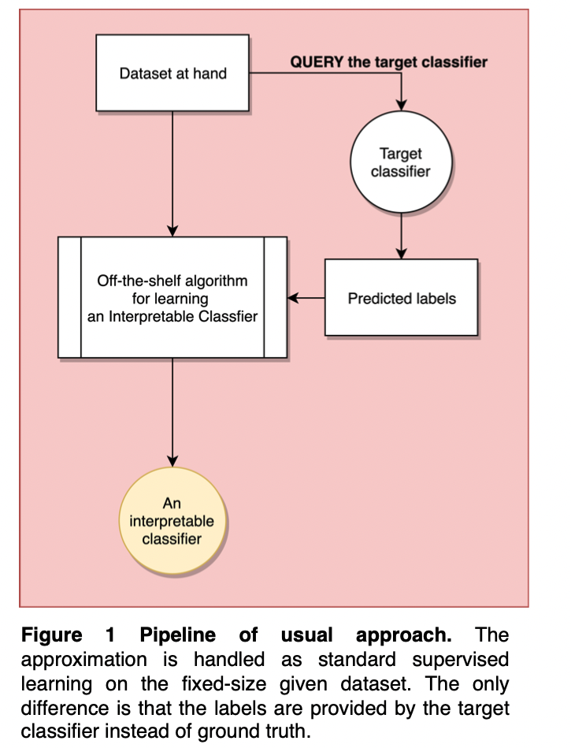
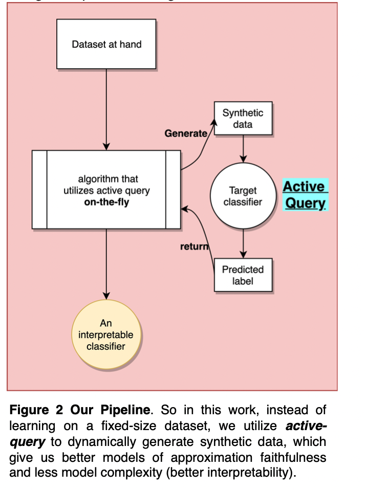
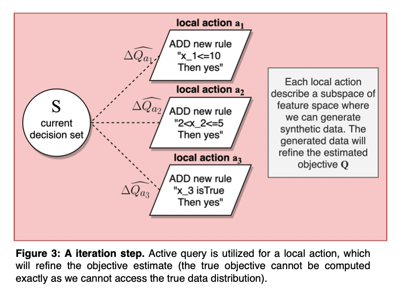

```{r setup, include=FALSE}
library(tufte)
# invalidate cache when the tufte version changes
knitr::opts_chunk$set(tidy = FALSE, cache.extra = packageVersion('tufte'))
options(htmltools.dir.version = FALSE)
```

## The task of model interpretation

* Model interpretation is a task where we try to approximate a blackbox model $f$ (e.g. DNN) with a simpler and more interpretable model $g$.

* (In my case, $g$ is a decision rule set). 

* Usually it is done by letting $g$ to approximate $f$ on a given dataset $D$, minimize $$ \sum_{x \in D} L\left(g(x) - f(x)\right)$$

## We choose an active approach

We can treat $f$ as an oracle to query new data samples. Our approach is novel because we generate and query the samples **on-the-fly** along with the local search procedures.

<center>


<center/>


## Active Decision Set Induction

* The trick for the active learning part is inspired partially from **pure-exploration multi-armed bandits**, by dynamically bounding and cut actions.

* We show that this **on-the-fly** generation&query improves the approximation faithfulness. And is also better and more efficient than generating a dataset first and then fit a model.

<center>

<center/>


