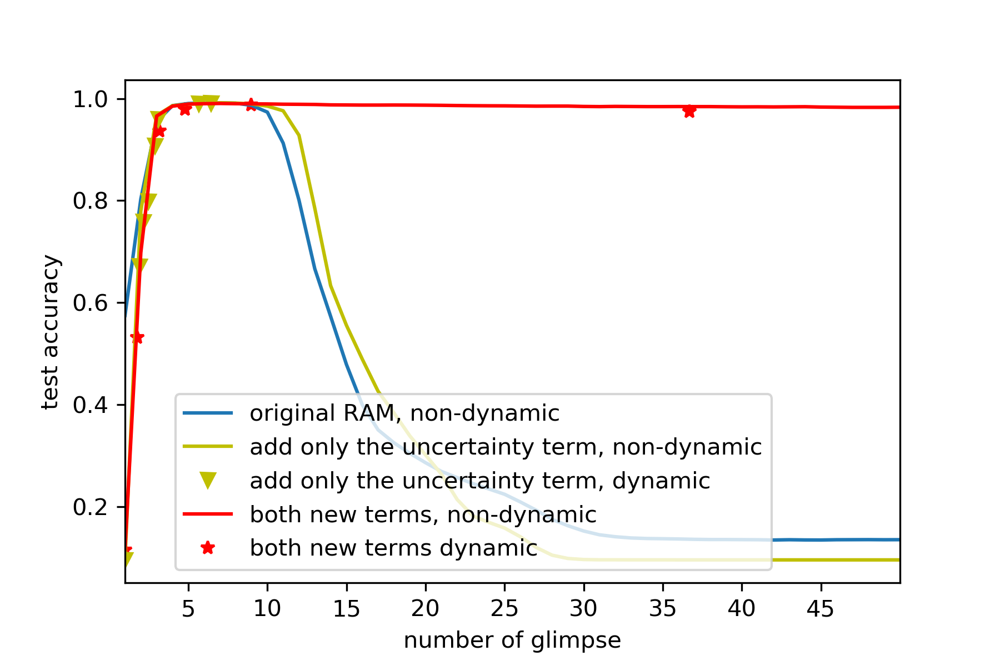

```{r setup, include=FALSE}
library(tufte)
# invalidate cache when the tufte version changes
knitr::opts_chunk$set(tidy = FALSE, cache.extra = packageVersion('tufte'))
options(htmltools.dir.version = FALSE)
```

## 


We revisit the seminal Recurrent Attention Model (RAM Mnih et al 2014), a recurrent neural network for visual attention, from an active information sampling perspective.


RAM combines a recurrent neural network with reinforcement learning: it chooses a specific region to look (a 'glimpse') in an image, and the recurrent network aggregates the information from multiple glimpses to make the final prediction.

I identify several drawbacks of the original RAM:

* slow convergence
* unable to dynamically set the number of glimpse per test instance
* problem of generalization to longer glimpses.

<div style="position: absolute;left: 800px; right: 20px; top: 250px">

<p>Recurrent Attention Model [ Source Andrej Karpathy blog](http://karpathy.github.io/2015/05/21/rnn-effectiveness/)<p/>
<div/>

## 

I then provide a simple solution for the above mentioned problems, by adding two neuroscience-inspired loss terms. The results are

* slow convergence -> quicker
* unable -> able to dynamically choose the number of glimpses per instance
* stable generalization over longer sequence of glimpses.

For example, the original RAM quickly degenerate for more glimpses, while the augmented version stays very stable.

<center>

<center/>
Performance of original RAM and augmented with two extra loss term


