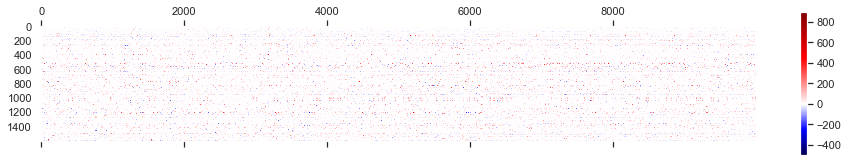
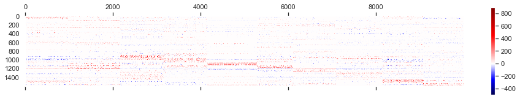
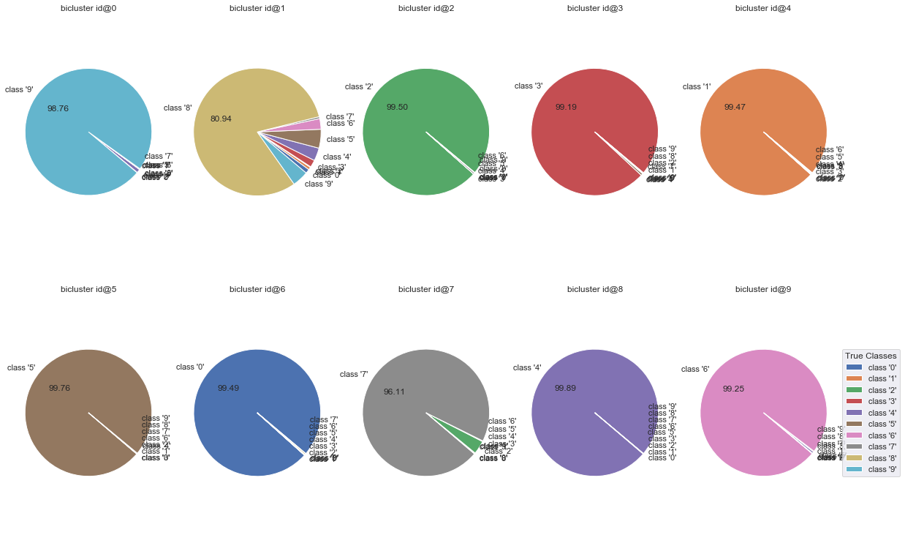
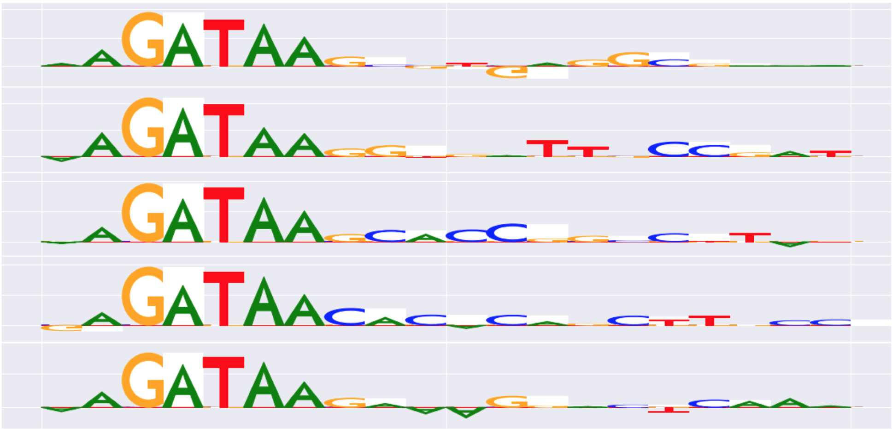

```{r setup, include=FALSE}
library(tufte)
# invalidate cache when the tufte version changes
knitr::opts_chunk$set(tidy = FALSE, cache.extra = packageVersion('tufte'))
options(htmltools.dir.version = FALSE)
```


## 

Given a pre-trained DNN, we can discover several modules of task-correlated neurons, meaning,
some hidden neurons in the same group are functionally related for predicting a set of similar data samples, i.e. samples with similar feature patterns. We do this by applying network attribution and biclustering methods. 





## 

We find that, unsurprisingly, the neurons are highly sparsely related, i.e., only a small subset of neurons are important for predicting a small subset of data samples

while we do not use any label supervision, samples corresponding to the same group (bicluster) show surprisingly coherent feature patterns.

<center>

<center/>

*Some neuron group are highly class-specific*, i.e., some neurons as a group are responsible to classifying a certain class

## 

We can also use our method to discover novel data patterns, for example, gene motifs.

<center>

<br> <p>Discoverd motif in gene sequence<p/>
<center/>


