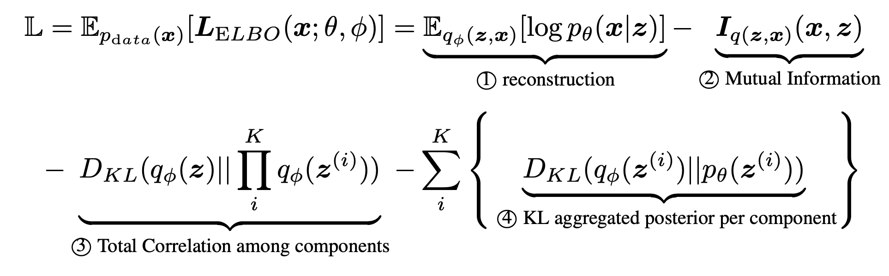
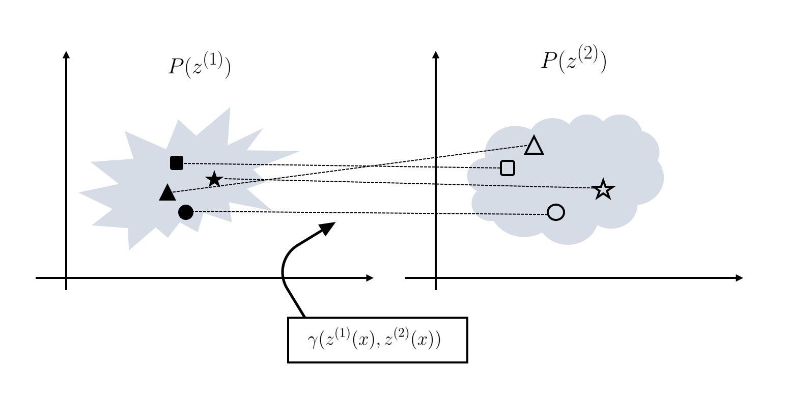
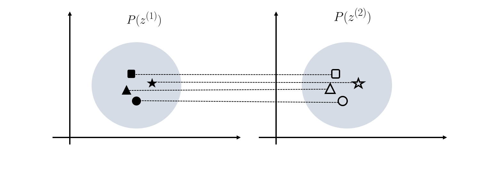
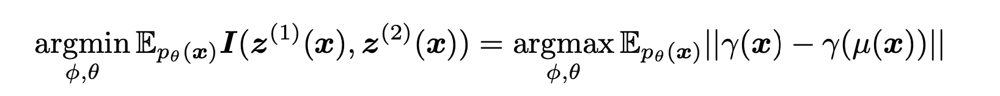

I studied the problem of disentanglement with a special yet very natural assumption and give a new formulation of objective, by a careful inspection and re-writing of ELBO. It turns out that the new objective surprisingly coincides with Schmidhuber's work<dt-cite key="Schmidhuber:1992:PM"></dt-cite> on probabilty minimization for factorized binary code  (1992). This makes me start to wonder the probabilty minimization (PM) still leaves a huge room for further investigation.

The subtitle is dubbed 'an obsolete attempt' simply because of the ICML 2019 paper <dt-cite key="Locatello:2018:Challenging"></dt-cite> from Google, which gives very frustrating results on this general direction of disentangled learning using VAE. I make some discussion regarding this issue at the very end of this post.

People who are familiar with the topic can start with the subsection **Decomposing ELBO**.

## Structure

1. Introduction

    > Introduce the problem and the perspective of our new assumption.

2. Inspect ELBO

    > Start from the beginning of variational autoencoders, and see if the implicit notion of heterogeneous components can be induced directly from the original evidence lower bound objective (ELBO).

3. New objective for disentanglement under this new assumption

    > At the core of it is the new proposed Latent Transport Discrepancy (LTD).

We are interested in learning disentangled representations that uncovers multiple underlying generative factors from real-world observations. We argue that these factors should have heterogeneous natures -- following different sizes and prior distributions. Previous approaches, such as setting a unit Gaussion as prior, lacks flexibility regarding latent representations' capacity to capture the true generative factors. The problem here is how to come up with a some-what agnostic approach for disentanglement learning, agnostic to those different sizes&priors. In this paper, we leverage the disentangled representation learning to the component-level where heterogeneous components could use different sizes and prior distributions and independently controls the true generative factors of variations.

## Introduction

The world is inherently well structured, or at least we human beings would be very happy to assume so. It is quite common for us to assume that real-world observations are controlled by a set of components. For example, a in-room object could be parameterized by 'object type', 'postion', 'color' and 'size' and we know that these properties could be easily controlled without effecting the others, if we are the programmers of this world -- this is exactly when we say we learned the disentangled representations of this object. It becomes even clearer to us that in computer graphics when we are designing a virtual object in video games, we understand the disentanglement and actually have the power to manipulate these parameters. This problem is formally refered as disentangled representation learning which, according to <dt-cite key="Lake:2016:BM"></dt-cite>,  should be able to boost the performance of state-of-the-art AI approaches in situations where they still struggle but where humans excel.

Our hypothesis is that these components -- some times we call factors of variation, or representations -- could be of heterogeneous nature. That is, some components may be simple, taking only a binary value, while others could be very complex, being multivariate variables. Previous work on disentangle representation learning are all working on the dimension level, representing components using the same capacity, disregarding that different factors of variation could be heterogeneous and cannot be all represented by just one dimension.

We propose a general framework to learn disentangled heterogeneous components that could represent and manipulate the factors of variation independently. Previous appoaches fail or simply ignore to consider the independence between latent representation such as the vanilla VAE<dt-cite key="Kingma:2013:VAE"></dt-cite> and its follow works , or can only work in some mild conditions, such as using a isotropic unit Gaussian as prior <dt-cite key="Kumar:2017:VI"></dt-cite> , but do not scale to more complex and flexible prior distribution families. Our framework, instead, is distribution-agnostic and can sovle some existing problem such as the information preference problem in the variational auto-encoding framework.

## Background

Let $D = {X,Z^*}$ to be the set of real-world observations $X = {x}^{N}$ and $Z^*$ the true latent representations, which is not available. Let $\{Z^{(1)},Z^{(2)},...,Z^{(K)}\}$ to be the latent code consists of $K$ components where each $Z^{(i)}$ could be of different size and prior distributions.

### Variational Auto-encoding Bayes

Given a generative model $p_{\theta}$ parameterized by $\theta$, we are interested in finding an appropriate approximate posterior inference model $q_{\phi}(Z| x)$ i.e., the latent variable $Z$ given an observation $x$.

Let us now introduce $q_{\phi}(Z| x)$ as a **recognition model** to approximate the intractable true posterior $p_{\theta}(Z|x)$ with the prior $p(Z)$. Normally, $p(Z)$ is deliberately chosen to be simple, such as an isotropic unit Gaussian $p(Z) = N(0,I)$.

We aim at maximizing the likelihood $E_{p_{data}(x)}[log p_{\theta}(x)]$ as well as minimizing the divergence between $p_{\theta}(Z|x)$ and $q_{\phi}(Z|x)$ which we shall use Kullback-Leiler divergence to measure.

This likelihood is intractable to directly optimized, since it requires integration over entrie space of $Z$. The classic approach <dt-cite key="Kingma:2013:VAE"></dt-cite> to abtain a natural optimization objective $L$ is to maxmize
$$L_{ELBO} (x;\theta,\phi) =  E_{p_{\theta}(x)}[\log p_{\theta}(x)] - D_{KL}( p_{\theta}(Z|x) || q_{\phi}(Z|x) )$$
$$ =  E_{q_{\phi}(Z|x)}( \log p_{\theta}(x|Z) ) - D_{KL} ( q_{\phi}(Z|x) || p_{\theta}(Z) ) $$
which is commonly refered as the Evidence Lower Bound Objective (ELBO).
This ELBO has a very intuitive interpretation that the first term is the expected negative reconstruction error while the second term acts as regularization, to fit the approximate posterior with the prior distribution.

$$
L_{ELBO} (x;\theta,\phi) =  L_{\text reconstruction} + L_{\text prior}
$$

This variational lower bound could be efficiently estimated by the SGVB estimator  in the auto-encoding framework using the reparameterization trick <dt-cite key="Kingma:2013:VAE"></dt-cite>. A example of how the reparameterization trick works is that if we hypothesize the VAE uses $q_{\phi}(Z|x)$ having the form of $N(\mu_{\phi}(x),\Sigma_{\phi}(x))$, then both $\mu_{\phi}(x)$ and $\Sigma_{\phi}(x)$ are directly modelled as the outputs of a deep neural network parameterized by $\phi$.
With the help with stochastic gradient optimizers such as SGD (or Adagrad (<dt-cite key="Adagrad"></dt-cite>) and Adam (<dt-cite key="Adam"></dt-cite>) ), an approximated inference model could be obtained given the continuous latent space.

### Representation Disentanglement

VAEs trained with even vanilla ELBO shows good disentanglement, for example, in MNIST digit images <dt-cite key="Kingma:2013:VAE"></dt-cite>.
An important progress in this line of research would be the $\beta$-VAE <dt-cite key="Higgins:2016:Beta"></dt-cite> which adds a hyperparameter $\beta$ in the original ELBO such that the second term in ELBO is re-weighted as:

$$E_{q_{\phi}(Z|x)}( \log p_{\theta}(x|Z) ) - \beta D_{KL} ( q_{\phi}(Z|x) || p_{\theta}(Z) )$$

We set $\beta$ to be a large constant (typically $\beta > 1$), the modified objective puts extra penalty encouraging the model to learn independent disentangled latent representations.

On the other hand, several supervised methods have managed to learn independent latent representations that are sensitive to single-dimension generative factors, for example, Inverse-Graphics Network<dt-cite key="Kulkarni:2015:DCIGN"></dt-cite> (IGN) successfully trained a model to represent object type, postion, lighting and scaling in different units of latent variables in a fully-supervised manner where the generative factors as well as the true generative process are known a priori, as the images used in the IGN <dt-cite key="Kulkarni:2015:DCIGN"></dt-cite> are exactly rendered under the true generative factors. This experimental setting, however, may not be easy to reproduce since it is generally impossible for human to fully understand an non-artificial generative process from true factors to observations, such as the content-style seperation of artistic paintings.

### Problems

However, despite the successful disentanglement and reconstruction on various datasets, we find thatthe vanilla ELBO objective, which is the base stone for many works, still suffers some severe problems in the learning of disentangled representations.

#### The Information Preference Problem (or known as the posterior collapse)

One of the most common problem is the extremely poor amortized approximation of posterior probabilty, which is first formally studied in <dt-cite key="Chen:2016:VLA"></dt-cite>. It discusses that when we employ a sufficiently flexible and expressive model for approximating $log p_{\theta}(x|Z)$, this model might completely ignore the latent representations while achieve very concise and perfect reconstruction.

Let us take a closer look back at the original ELBO, it turns out that with a sufficienty expressive conditional model, the latent representation $p(Z|x)$ for different $x$ tends to become completely disjoint and do not overlap one another.  Meanwhile the reconstruction term $L_{\mathrm reconstruction}$ becomes infinitely large, indicating extreme overfiting. In this scenario, the qualitive results would show that, the reconstruction of observations is nearly perfect yet interpolation of two observations or traversal along one dimension would make no sense, failing to capture the true generative process.

On the other hand, putting extra penalty on $L_{\mathrm prior}$ such as $\beta$-VAE <dt-cite key="Higgins:2016:Beta"></dt-cite> enforcing it to match the prior distribution may result in good amortized posterior and disentanglement, yet not with state-of-the-art reconstruction performance. If the penalty weight $\beta$ is severely large, the learned latent code may not even contain sufficient information about the observation so that the reconstruction is bounded to fail.
This was reflected in a trade-off: vanilla variational auto-encoder tends to ignore the latent representation for perfect reconstruction, and modified approaches that strongly disentangles will only be able to give blurring images, indicating a poor recovery of observations from latent representations.

The information preference problem tends to encode every sample $x$ into different disjoint latent representations, centered at $Z$. As a result, the vast majority of the latent space would have near-to-zero probabilistic density, except that $p(Z|x)$ for a given sample becomes extremely large.
In other words, the variational inference model inevitably over-estimate the variance when trained to convergence with vanilla ELBO, which is studied in <dt-cite key="Zhao:2017:InfoVAE"></dt-cite>. To solve this problem <dt-cite key="Zhao:2017:InfoVAE"></dt-cite> proposes to substitue the  $L_{\mathrm prior}$ with $ D_{KL}( p_{\theta}(Z) || q_{\phi}(Z))$, the marginal KL divergence from the aggregated posterior $p(Z)= E_{p_{\mathrm data}(x)}[q(Z|x)]$ to the prior $p(Z)$. The information preference problem is significantly improved using this aggregated marginal posterior to fit the prior. We will show that this substitution could be directly derived from the original ELBO along with encouraging independence among latent representations.

#### Choice of Prior

While the original VAE work has been shown to achieve good disentangling performance with a trade-off of reconstruction. We see that on simple datasets, such as FreyFaces or MNIST <dt-cite key="Kingma:2013:VAE"></dt-cite>, disentangle representation are learned successfully , but the same framework does not scale to more complex datasets. We argue that this may result from a too simple prior distribution compared with the complex nature of larger datasets.

The choice of the prior probabilty $p(z)$ could influence a lot about the learned inference model as suggested that the prior $p(Z)$ controls the capacity of the latent information bottleneck. We argue that one way to bypass the information preference trade-off problem is to prvide the VAEs with more flexible prior distributions. If we wish to learn latent representations for a given data set, appropriate priors are an essential step towards successful disentanglement and reconstruction.

However, one remark on the current paradigm of learning independent representation in VAEs is that, the usages of learned representations are only studied at the dimension level, as the qualitive experiment is commonly a traversal along one latent axis where the rest being fiexed, and hence independence of latent representations are introduced at the dimension level. Intuitively, in <dt-cite key="Higgins:2016:Beta,Kulkarni:2015:DCIGN"></dt-cite>, it may make sense to claim that one dimension controls the object class, or the scaling of 2D and 3D objects, but there might also be factors that cannot be appropriately represented as just one dimesion, for example, the object position and the lighting.

Viewing all these problems in a more general perspective where multiple **components** following different size and priors would be a good solution to scale disentangled representation learning in complex datasets.

## Method
Unlike <dt-cite key="Zhao:2017:InfoVAE"></dt-cite> which substitutes the original $L_{\mathrm prior}$ with $D_{KL}( p_{\theta}(Z|x) || q_{\phi}(Z|x) )$ encouragin learning a good distentangled inference model or adds it as an extra term <dt-cite key="Kim:2018:DF"></dt-cite>, We show that this term could be directly derived from the vanilla ELBO when we want to model the independence among components. We decompose the expectation of $L_{p_{\mathrm prior}}$ as

$$E_{p_{\mathrm data}(x)}[D_{KL} ( q_{\phi}(Z|x) || p_{\theta}(Z) )]$$
$$= E_{q(x,Z)}[  \log q_{\phi}(Z|x) - \log p_{\theta}(Z) +\log q_{\phi}(Z) - \log q_{\phi}(Z)]$$
$$= I_{q(Z,x)} (x,Z) + D_{KL}(q_{\phi}(Z)|| p_{\theta}(Z))$$
Where $I_{q(Z,x)} (x,Z) = E_{q(Z,x)} [\log \frac{q(Z,x)}{q_{\phi}(x)q_{\phi}(Z)} ]$ is the mutual information of $Z$ and $x$.

The second term, KL divergence between the aggragated posterior and the prior could be further decomposed by

$$ D_{KL}(q_{\phi}(Z|x)|| p_{\theta}(Z)) = E_{q(Z,x)} [ \log q_{\phi}(Z) - \log p_{\theta}(Z) + \log \prod_i^K q_{\phi}(Z^{(i)}) - $$
$$ \log \prod_i^K q_{\phi}(Z^{(i)}) +  \sum_{i}^{K}  \log \prod_j q_{\phi}(Z^{(i)}_j) -  \log \prod_i q_{\phi}(Z^{(i)}_j)  ] $$

$$= D_{KL}(q_{\phi}(Z)|| \prod_i^K q_{\phi}(Z^{(i)})) + \sum_{i}^{K} \left\{ D_{KL}(q_{\phi}(Z^{(i)})|| \prod_j q_{\phi}(Z^{(i)}_j)) + \sum_j D_{KL}(q_{\phi}(Z^{(i)}_j)||p_{\theta}(Z^{(i)}_j))]   \right\} $$

The final result in full would be

<figcaption style="text-align: left;">
A full expansion of the ELBO of VAE.
</figcaption>

### Decomposing ELBO

The above formulation follows a similar decompostion (<dt-cite key="Hoffman:2016:ELBO,Chen:2018:IS"></dt-cite>), but their decompostion are based on dimension-level where the $Z$ is a isotropic unit Gaussian and $Z^{(i)}$ be a one-dimension variable. In our framework, $Z$ is a set of multiple heterogeneous components with different priors and thus the direct modeling of ③ becomes intractable and cannot be optimized directly. We now further construct a approximation bound for ③ measuring independence with a pair-wise basis.

### Intuition of Formulation

The first term ① could be viewed as the negative reconstruction error recovering the original observation from latent representation. In a similar decomposition <dt-cite key="Hoffman:2016:ELBO,Chen:2018:IS"></dt-cite> the second term ② is refered as  **index-code mutual information**. It could be viewed as a lower bound of the mutual information beween $p_{\theta}(x)$ and $q_{\phi}(Z)$ under the true generative probabilty. However, <dt-cite key="Chen:2016:InfoGan"></dt-cite> argues that a larger ② indicates better disentanglement.

This is in conflict with our optimization objective since we want to maxmize the overall ELBO. Futhermore, despite the fact that ② serve the same intuitive meaning to reconstruct $p_{\theta}(x|Z)$,  ② is relatively very weak because it is bounded above and below by $0$ and $\log N$. Some <dt-cite key="Makhzani:2015:AA,Zhao:2017:InfoVAE,Chen:2018:IS"></dt-cite> has proposed to completely disregard this term in practice yet still get ② nearly close to $\log N$ after the training.

The third term is refered as **the total correlation** in information theory, which is in fact a more general form of mutual information with multiple variables.

Intuitively ② captures the **multivariate mutual information** and could be zero if and only if all components $Z^{(i)}$ are independent, and has been used to characterize the disentanglement and statistical independence of learned representations ( <dt-cite key="Dinh:2014:NICE,Achille:2017:OEI,Gao:2018:AETCE"></dt-cite> )

 ③ indicates how dependent there variables are, and by penalizing ③ we expected to learn statistically independent components. However, directly optimizing this term is not trackable and always needs construction of $p_{\theta})x$ and $q_{\phi}(Z)$ and sample from them.
Measuring the independence among latent variables does not currently have a good solution.
An easy way to bypass this problem is to provide a alterbative optimization objective like <dt-cite key="Kumar:2017:VI"></dt-cite> which introduce a technique matching the covariance of two Gaussians and tries to fit it to the identity matrix to ensure the independence among all the dimensions. Using the reparameterization trick, the independence among dimensions could be directly optimized by minimizing
$$\sum_{i \neq j} [ \sigma_{p_{\theta}(x)}(\mu_{\phi}(x))\_{ij} ]^2 + \sum_{i} [\sigma_{p_{\theta}(x)}(\mu_{\phi}(x))\_{ii}-1]^2$$
where $\sigma$ denotes the covariance.

However, this technique could not generalize to complex cases where different latent components are heterogeneous, having different size of dimesions . We provide in the next section on sculpting latent representations consists of multiple independent heterogeneous components into different priors.

### Utilizing Latent Transport Discrepancy

Both the mutual information term and the total correlation could not be directly optimized, suggesting that we need some tricks to make it computationally trackable.
In this section, we first show that the total correlation term ③ could be relaxed into a approximation of combinations of component-wise mutual information and then provide a novel framework called Cross-component Transport Discrepancy to provde a simpler and more efficient estimation of pair-wise dependence between each component pair.
We reduce ③ to the difference form of information entropies,

$$ D_{KL}(q_{\phi}(Z)|| \prod_i^K q_{\phi}(Z^{(i)})) = \sum_i^{K} H(Z^{(i)}) - H(Z) $$
$$= \sum_{1 \leq i_1<i_2 \leq K} I(Z^{(i_1)},Z^{(i_2)}) - \sum_{k=3}^{K} (-1)^{k+1} ( \sum_{1 \leq i_1 < i_2 < Dots < i_k \leq K} I(Z^{(i_1)},Z^{(i_2)},Dots,Z^{(i_k)} )  )$$
The second equation could be gained by applying the inclusion–exclusion principle.
We here make a relaxation to disregard the mutual information involving more than two variables and only take into account
so that

$$D_{KL}(q_{\phi}(Z)|| \prod_i^K q_{\phi}(Z^{(i)}))  \simeq \sum_{1 \leq i_1<i_2 \leq K} I(Z^{(i_1)},Z^{(i_2)})$$

Note that the total correlation measures the **mutual independence** among multiple variables, while pair-wise independence does not strictly indicate mutual independence. But this step clearly sets us in a familiar enviroment on modeling the dependence (or independence) between two distributions.

But how to measure mutual information? Note that pair-wise mutual information is still intractable to directly optimize. For simplicity, from now we will assume $K=2$ so that there are only two latent components $Z^{(1)}$ and $Z^{(2)}$, and that they happens to have a prior of isotropic unit Gaussian of $d_1$ and $d_2$ dimensions, respectively. We will move on to other distributions later.

<figcaption style="text-align: left;">
 Each shape denotes the latent representation $Z^{(1)}(x)$ and $\Z^{(2)}(x)$ of the same observation $x$ and $\gamma(Z^{(1)}(x),Z^{(2)}(x))$ denotes the conditional transport plan from $Z^{(1)}(x)$ to $Z^{(1)}(x)$
 Our problem is that when we know the exact bijection of each sample pair, we want to measure the variance, or the discrepancy of transport of each latent pair. Note that the related optimal problem tries to find the best amortized $\gamma$ to transport from one distribution to the other, we are interested in the property of $\gamma$s that, if all $\gamma$s are similar, then we say these two distributions are relevant, thus statistically dependent.
</figcaption>

Let us consider the probabilty distribution of $q(Z^{(1)})$ and $q(Z^{(1)})$ seperately. We denote $\gamma_{1 \mapsto 2}(Z^{(1)}(x),Z^{(2)}(x))$ the conditional transport plan from $Z^{(1)}(x)$ to $Z^{(1)}(x)$ and then use an abbreviation $\gamma(x)$.

Our insight here is that if all moments from one distribution could be transported into the other using the same transport plan $\gamma$, i.e. all $\gamma(x)$s are the same for each sample $x$, then these two distributions are in fact equivalent. This could be explained from a mutual information perspective .If these $\gamma$s are to an extent of completely randomness, then it would indicate a near-zero mutual information $I(Z^{(1)},Z^{(2)})$ ,that $Z^{(1)}$ and $Z^{(2)}$ are statistically independent.
This is actually a adanced form of the optimal transport problem, where the OT problem tries to find the best transport plan given a cost distance, our problem is that when we are given exactly the transport plans for each pair, we want to measure the variance of such plans.

Let's first consider the case where $q(Z^{(1)})$ and $q(Z^{(2)})$ shares exactly the same distribution and only differs in its mean. Then for each pair of latent representation $Z^{(1)}(x)$ and $Z^{(1)}(x)$, $\gamma_{1 \mapsto 2}(x)$ remains a static constant, we shall say in this scenario, $q(Z^{(1)})$ and $q(Z^{(2)})$ shoud have a high mutual information and are in fact strongly dependent on one another.

In a heterogeneous case where $Z^{(1)}$ and $Z^{(2)}$ uses a different size of $d_1$ and $d_2$ dimensions, respectively. We use a linear transport for $\gamma$ that $Z^{(2)} = W_{d_2 \times d_1} Z^{(2)}$ and thus

$$\gamma_{1 \mapsto 2}(x)=\gamma_{1 \mapsto 2}(Z^{(1)}(x),Z^{(2)}(x)) = \{ W(x) \}$$

<figcaption style="text-align: left;">
The concept of Latent Transport Discrepancy is introduced to measure how easily a transport between two distribution could be if we know the exact one-to-one mapping of all sample pairs.
 The bottom plot's transport are almost identical, so in other words, all samples in $Z^{(1)}$ could be transported into $Z^{(1)}$ with the same transport, that is, $\gamma$ is same and does varies. Meanwhile, in the top plot, the transports $\gamma$ for each pair does varies and have a higher 'variance'.

</figcaption>

We measure the discrepancy of all $\gamma$s to approximate the mutual information as (see the above figure for illustrated explanation):

where $\mu_{x}$ denotes the mean of $x$ and we use a Frobenius norm. If we take $\gamma$ to be linear transport $W$, then in order to minimize the mutual information,our objective is to maxmize $E_{p_{\theta}(x)} {\| W(x) - W(\mu(x) ) \| }_{\mathrm Frobenius}$

The complete form of rewritten ELBO is

Note that we set $\lambda_2=0$ to disregard the mutual information between $Z$ and $x$ completely. This objective surprisingly coincides with the probabilty minimization for factorized binary code <dt-cite key="Schmidhuber:1992:PM"></dt-cite>, however, <dt-cite key="Schmidhuber:1992:PM"></dt-cite> works only on binary codes and take a probabilty minimization with auxiliary classifiers thus bypass the heterogeneous case. Our approach, instead, is proposed to directly encounter the heterogeneous component disentanglement problem and do not need any auxiliary classifiers.

### Estimator and Algorithm

Note that ④ could be further decomposed into

for every component $Z^{(i)}$. A similar approach like <dt-cite key="Kumar:2017:VI"></dt-cite> could be employed if a unit Gaussian is set to be $Z^{(i)}$'s prior. If some other distribution, e.g., a Bernoulli, <dt-cite key="Kumar:2017:VI"></dt-cite> might not work. But our framework should be capable of that.

For $D_{KL}(q_{\phi}(Z),p_{\theta}(Z))$, we employ a similar matching using the maximum mean discrepancy proposed by <dt-cite key="Zhao:2017:InfoVAE"></dt-cite> and the reweighted estimation of approximating posterior distribution (<dt-cite key="Zhao:2017:InfoVAE"></dt-cite>).

## Discussion, the disappointing results from Locatello et al, 2018

All the above formulation seems to be sound and good, and I've also experimented and got some good results compared with some baselines on some datasets like cifar and dSprites.

But then comes the ICML 2019 paper<dt-cite key=
"Locatello:2018:Challenging"></dt-cite> (Locatello et al, 2018) which challenges the entire direction of unsupervised disentanglement learning, as along with very strong emprical evluation. It concludes that the unsupervised disentanglement is theoritically impossible (with condition) and emprically all those methods (which are discussed also in this post) are only chances of good randomness, that randomness plays a more significant effect than all the formulations.

In a massive scale evluation, different baselines of unsupervised disentanglement learning are tested in different datasets with different randomness. The results are frustrating, but somehow it convinced me thoroughly. The unsupervised disentanglement of representation previously lack a rigorous way for evaluation, partially due the fact we do not understand yet the Deep Neural Networks, the architectures we use and the optimization methods like SGD. Too many unknown factors are hidden behind the scene and we dare to play this sophisticated game of disentanglement learning.

But in the other hand, one is also inspired to think alternative ways for the goal of disentanglement. Consider human, which of certainty can do some sort of disentanglement, consider the fact that we can manipulate many factors by imagination in the brain. One way of human learning is the source of various types of weak but diverse learning signals. Yes most of these learning signals are weak, but we have too many types of it. Certainly one or a subset of these signals can really help us and eventually enable us for the disentangled representation we have. One simple option to consider, from my opinion, is the idea of "Active Confirmation". The learner can ask the human or other experts, whether two samples shared some value of generative factors. I am sure some tools of active learning works can be utilized, please contact me should you have some ideas.

I will also see into some literature on active learning on my own.

## Conclusion

I give in this post a new formulation of ELBO and a new proposed method for approximation. The resulted formulation is very similar to Schmidhuber's work <dt-cite key="Schmidhuber:1992:PM"></dt-cite> the probabilty minimization for binary factorized codes. I also introduce the work of Locatello et al, 2018 <dt-cite key="Locatello:2018:Challenging"></dt-cite> and its implications

Given the frustrating situation of reality, we shall come to a compromise that if we want a VAE inference should perform a good disentanglement on large and complex unsupervised datasets, we might need a little guidance when some auxiliary weak supervision could be provided.

But anyway, for me, I do not believe the problem of disentanglement can be solved in the very near future (for example, 10 years), so do not worry. There is still plenty of time.

Just relax, and play.
