```{r setup, include=FALSE}
library(tufte)
# invalidate cache when the tufte version changes
knitr::opts_chunk$set(tidy = FALSE, cache.extra = packageVersion('tufte'))
options(htmltools.dir.version = FALSE)
```

Jialin Lu^[[luxxxlucy.github.io](https://luxxxlucy.github.io/)],     July 8 2020

`r sans_serif(
"This is first given as a tutorial presentation at on the lab meeting of Martin Ester's group, at Simon Fraser University, 8th July 2020.
")
`

Slide can be found [here](./slide.pdf).

* I will first introduce what I mean by **more interesting blocks** in deep learning. I believe it will potentially benefit, or at least widen perspectives and possibilities for some of my dear lab members.
* We will restrict our attention to only a subset of **more interesting blocks**: blocks that have discrete parameters. This is because discretely-parameterized blocks already cover a lot of content and have received particular interests.
I will introduce Neural Architecture Search (NAS) and Neural DNF^[Lu, Jialin, and Martin Ester. 2020. “Neural Disjunctive Normal Form: An Inherently Interpretable Deep Learning Classifier.” *Manuscript under Review*. We do not have a preprint version but you can download [PDF here](./neural_dnf.pdf)] as two example. But as you may know, the technical problem is always about learning/optimization: conventional optimization methods like SGD and its variants are designed for continuous parameters.
* I will then introduce optimization methods for two cases. (1) For general cases that is not necessarily differentiable, we can optimize the parameters by techniques like local search, reinforcement learning; (2) For special cases where the entire forward computation is indeed differentiable or you can somehow come up with a differentiable version, we can then directly use gradient for learning which much more efficient; it is just that we will need some techniques on how to use gradients to update discrete parameters.
* At last, I will introduce a lot of possibilities on many more interesting blocks and then conclude.

<script>
  // Move TOC to the Table of Contents heading (with id "table-of-contents")
  $(function() {
    $( "#TOC" ).insertAfter( $( "#table-of-contents" ) );
  });
</script>

# Introduction: why we need more interesting blocks?
```{marginfigure}
 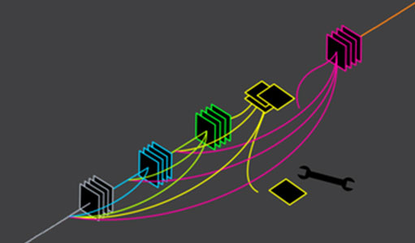
  <br>
  Freely assemble customized blocks is part of the fun of deep learning, if not all.
```
So why we need more interesting blocks and want to talk about it today?

> _The short answer is, well, for fun._
> `r quote_footer(" --- Jialin Lu")`


The promise of methodological advantages of deep learning approaches and the reason of its success on many domain&applications, is about **freedom**.

> _Freedom is, a little bit of ... flexibility._
> `r quote_footer(" --- Jialin Lu, yeah it's me again.")`


Within a tiny amount of freedom,
we can design many innovative modules/blocks and assemble them freely such that we obtain a parameterized forward computation procecss.
And by using gradients as learning signals, somehow we magically get some not-so-bad models^[I will use the term **model** and **forward computation** interchangeably, because in deep learning I think calling a model essentially means the executation of a forward computation process. If you do not get it, recall how you write code in PyTorch.].

From my point of view, this motivates the core reason on why deep learning is getting so popular and useful:

* you freely design a parameterized model.
* you somehow have ways to efficiently optimize(learn) the parameters.

These two points are both essential for the current popularity and usefulness of deep learning. If you do not have this little bit flexibility, the resulted model (the forward computation) is boring, you won't get published or ground to useful applications; but if you cannot efficiently optimize it, you are only making a delicate good-looking toy, but of no use.

I know many people actually have many ideas and here I would like to introduce how to work with more interesting blocks, and some of the interesting block you wish to develop may involve some discrete parameters. This is about to introduce some ways to how to learn such discrete parameters.

# Conventional Blocks
```{marginfigure}
 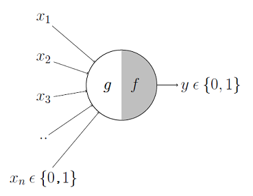
  <br>
  The origin of the deep learning story.
  <br> At that time, $g$ is called aggregation (formulated as a weighted sum) and $f$ is called decision function (a non-linear function)
```
Normal deep net, is more or less based on the Pitts model (McCulloch-Pitts Neuron, proposed by the neuroscientist Warren MuCulloch and logician Walter Pitts in 1943.).

Note that Pitts model is essentially first applying a linear transformation (weighted sum) and then applying a non-linear function. The original Pitts model assumes input $x$ and output $y$ to be Boolean  (0 or 1) and that the non-linear function is a binary step function (1 if >0 and 0 elsewise). Nowadays we generally say the input can take continuous values and use activation functions like ReLU as the non-linear function.

$$ y = ReLU(Wx+b)$$
(Note that the parameters $W$ and $b$ also takes continuous values.)

There is nothing wrong with it. Pitts model is the first and so far still the most commonly-used model for the abstraction of the biological neuron and it is surprising that it actually is still being used in most of the deep neural network of this decade.

I see Pitts model as boring because we are actually interested in using a deep learning block as the model of the actual brain. We are not neuroscientists, we are merely interested in computation. That means we just need it to perform some computation  tailored for some specific application. From this perspective, we can do more than this boring weighted-sum-then-ReLU, thus the name **more interesting blocks**.

Of course, weighted-sum (linear model) is well studied for decades. We have a whole bunch of literature from convex optimization focusing on it.
The theoretical foundation for it is strong.
On the contrary,
the interesting blocks we discussed here, all of them, do not have such a strong theoretical base. Please bear this in mind.
```{marginfigure}
To be frank, of course we care about theory: we care about bounds, guarantees, convergences, etc. Not today.

Today we just choose to leave all of that behind.
```

# Interesting blocks

Here I view any variant blocks based on the weighted-sum-then-ReLU as conventional blocks, including fully-connected-layer, conventional layers and recurrent layers. They share the properties that

* The form of computation is essentially linear transformation and then a non-linear activation function.
* All parameters that need to be learned are continuous.

```{marginfigure}
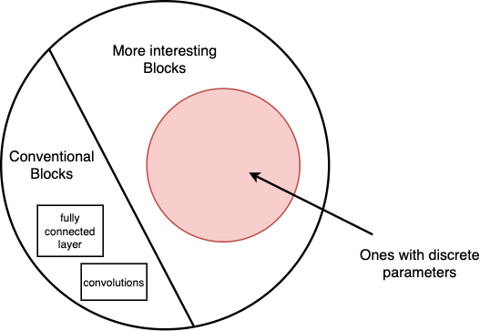
```

In fact, there can be infinite possibilities of interesting blocks and it is only natural that most of those possibilities haven't been discovered. Here we only focus on a subset of all potential interesting blocks.

We will restrict our attention to only a subset of **more interesting blocks**: blocks that have discrete parameters. This is because discretely-parameterized blocks already cover a lot of content and have received particular interests.

To help to get some sense on what I mean by  **more interesting blocks**, I give two examples:

* Neural Architecture Search (NAS): given some basic blocks, we try to find the best configuration on how to assemble them
* Neural DNF: Instead of weighted-sum-then-ReLU, we use IF-THEN rules as the forward computation of a block. (@Lu:2020:NeuralDNF, under review)

As you may know, the technical problem is always about learning/optimization: conventional optimization methods like SGD and its variants are designed for continuous parameters.

## NAS as a interesting block with discrete parameters

In Neural Architecture Search (NAS), we are given some basic units and we are interested in finding a good assemble of them.

We view the assembled computation graph as a new block. This block is, from my point of view, novel and interesting, because we do not know how to route among these basic blocks.


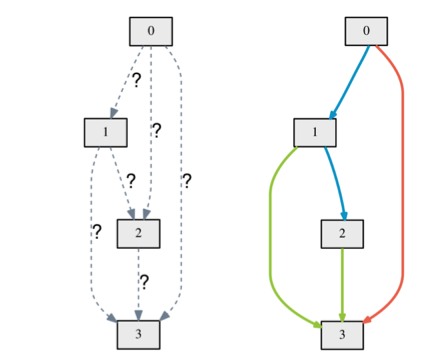


```{marginfigure}
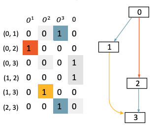
Formulating NAS as a block with discrete parameters: a binary matrix
```
The problem can be formulated as a discrete optimization problem.
We can formulate the edges of the graph as a adjacency matrix $M$, where a entry $M_{ij}$ equals 1 means we connect the basic block $i$ to block $j$, while each edge represents a weighted-sum-then-ReLU computation.

Now you can see what is the discrete parameters here. learning the continuous parameters is relatively easy, you simply apply gradient based optimization methods like SGD; Learning the adjacency matrix is not easy, you cannot simply apply SGD.

## Neural DNF as a interesting block with discrete parameters

Rule-based models, unlike linear model, is defined as a logical operation. Here is example model a rule set model for predicting whether a customer will accept a coupon for a nearby coffee house, where the coupon is presented by their car’s mobile recommendation device:

`r sans_serif(
"
**if**
a customer (goes to coffee houses ≥ once per month AND destination = no urgent place AND passenger ̸= kids)
")
`

`r sans_serif(
"
OR (goes to coffee houses ≥ once per month AND the time until coupon expires = one day)
")
`

`r sans_serif(
"
**then**
predict the customer will accept the coupon for a coffee house.
")
`

A rule set, or  a Disjunctive Normal Form, is considered to be the basic version of rule-based models.
Formally, a rule set model consists of a set of rules, where each rule is a conjunction of condi- tions. Rule set models predict that an observation is in the positive class when at least one of the rules is satisfied. Otherwise, the observation is classified to be in the negative class.
This the basic form of rule-based models, a rule-based model that takes Boolean input and produce Boolean outputs.

Usually we learn rule-based models by some discrete optimization algorithms (such as @Wang:2017:bayesian) and we do not use gradient to learn it.
However, learning such a rule model by gradient is certainly possible. The even better news is that, if we can learn rules by gradient, then it is useful when the input is in fact a output from another neural network, we can train the neural network and the rules end-to-end. (Interested readers can take a look on about our work.)

I give NAS and Neural DNF as two examples of interesting discretely-parameterized blocks.
There are more other possible blocks and I will briefly mention them at the end.

# General Cases: blocks with discrete parameters

There are general ways to learn discrete parameters. These general solutions apply to the cases where the entire computation is not differentiable.
IF not differentiable, we cannot use end-to-end backpropagated gradient for learning. This means the discrete parameters and continuous need to be trained separately.

But still, we have many methods that can be used here.
For example, taking neural architecture search (NAS) as the target problem:

For one, we can use the algorithm called **graduate student local search**.
Let us say we have a graduate student called Jialin and we can let Jialin to come up of some good ways of assembling some basic units.
Jialin will run the model towards convergence, evaluate and see some performance metrics. Jialin will continue to devise more other possible assembles and run them as well.
In the end, Jialin collects all the metric data and then select the best one.

**Graduate student local search** is by no means efficient or has any theoretical guarantees. One thing worth trying is to use some **automation**.

We can use some more *automatic* solutions that involves some heuristics algorithms. This includes many combinatorial discrete optimization algorithms, for example, evolution algorithms @Real:2019:regularized. If we are given enough hardaware and computation support, this is certainly possible and it won't be a surprise that we can find some architectures that is better than hand-designed ones.

We can also try something even fancier, like reinforcement learning @Zoph:2018:learning. We let a controller neural-network to sample some architectures.

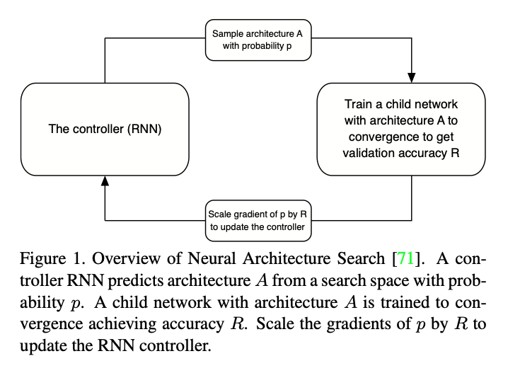

Note that to train the controller network, we can use policy gradient, based on @Williams:1992:simple. Note that this does not require the entire process to be differentiable, the training process of a deep network until convergence is not easily differentiable. (Yes I know there is actually someway to have a differentiable version of it, but not very easy).

One thing worth mention is that the reinforment learning technique applies to any problem setting as long as you can figure up in a act-reward setting.
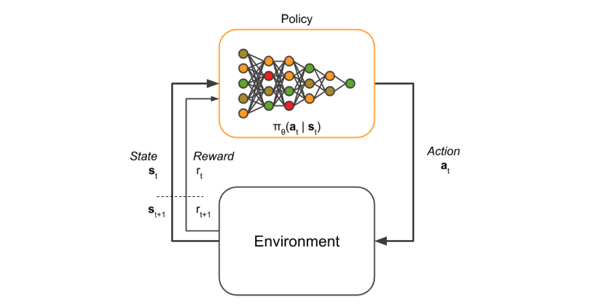
For reference, I recommend a phd thesis on using it in robotic applications @penkov:2019:learning. It will definitely be an interesting read, even not super close to our topic today.

# Special cases: differentiable

It all seems well that we have many tools for the general case, but I would like to emphasize here that all the above solutions are not so satisfactory: it is about efficiency.

Why? Recall that in the previous methods for NAS, each step requires to you to train the entire network to convergence. Unless it is for big tech companies, this is sometimes too expensive a price to pay, especially for our lab members.


```{marginfigure}
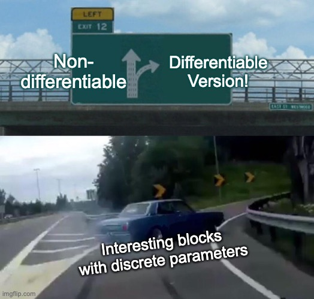
```
Here we are going to introduce a cheap solution, or a general theme underlying many advances of deep learning: we convert a model into a differentiable version, and then we can optimize by gradient, which is highly efficient and often leads to super-great model performance.

This is also a general lesson we learned during the years, that being differentiable often bootstraps the performance compared to using reinforment learning technique to optimize non-differentiable ones.

If we can convert into a differentiable computation, then both the discrete parameters and the continuous parameters can be trained jointly in an end-to-end manner. We do not have to train the discrete parameters and then continuous parameters in an alternating-manner anymore.

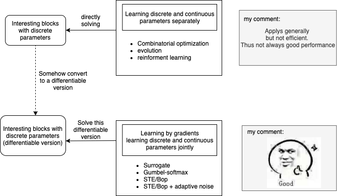

Finding a differentiable version might not be so straight forward and easy. It might take some efforts, but not impossible.

```{marginfigure}
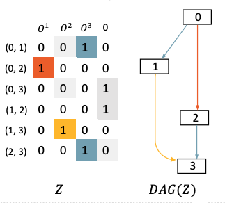
```

`r sans_serif(
"
For example,
for NAS, we can find a differentiable version by first considering it as a directed acyclic graph.
")
`


Nodes $x_i$ in this DAG represent latent representation, whose dimensions are simply ignored to avoid abuse of notations. In convolutional networks, they are feature maps. Edges $(i, j)$ represent information flows and possible operations $O_{i,j}$ to be selected between two nodes $x_i$ and $x_j$.
To make the skip operation included, nodes are enforced to be ordered, while edges only point from lower indexed nodes to higher ones. Thus we have intermediate nodes $x_j = \sum_{i < j} O_{i,j}(x_i)$.

In this way, the entire computation now involves discrete parametes (the adjacency matrix) and also the continuous parameters and is differentiable.

By using this differentiable version, we can use gradient to optimize the whole thing, both discrete and continuous parameters, **AT THE SAME TIME**!

The differentiable version allows directly using gradient for learning, although we will need some techniques on how to optimize discrete parameters using gradient. But in terms of advantages for this differentiable version, it is much more efficient and give better performance, such as the works like the SNAS approach by @xie:2018:SNAS (using the Gumbel-softmax trick which will be later introduced) and the DARTS approach by @liu:2018:DARTS (using reinforment learning but different with the above mentioned one).

`r sans_serif(
"
We can also find a differentiable version for DNF.
")
`


The original DNF is computed by logical computations. The discrete parameters here are abinary matrix $W$ and a binary vector $S$
$$
\hat{y} =
\bigvee_{S_j=1}^N \bigwedge_{W_{i,j}=1} x_i
$$

It is not differentiable and thus cannot compute the backward gradient.

But we are lucky we are able to find a differentiable version of it that executes exactly the same computation, but is differentiable.
```{marginfigure}
In the Neural DNF paper, the formulation is in fact a little more sophisticated. First, the input to the rules are output from another networks. Second, to deal with negations, the input $x$ is concatenated with its negation $\neg x$, meaning $x$ and $\neg x$ are first concatenated together and then feed as input to the rules.
```

$$
r_j = \bigwedge_{W_{i,j}=1} x_i
% \rightarrow
\qquad\xrightarrow{\text{replaced by}}\qquad
r_j
= \prod_{i} F_{\text{conj}} (x_i, W_{i,j})
\text{,  where }
F_{\text{conj}}(x,w) = 1 - w(1-x)
$$
$$
\hat{y} = \bigvee_{S_{j}=1}^N r_j
% \rightarrow
\qquad\xrightarrow{\text{replaced by}}\qquad
\hat{y} = 1 -  \prod_{j}^{N} (1 - F_{\text{disj}} (r_j, S_j ) )
\text{,  where }
F_{\text{disj}}(r,s) = r \cdot s
$$


Obtaining this differentiable version is not novel, and certainly not our invention, similar formulation can be found in the literature such as the logical activation functions (see @Payani:2019:NLN and @Wang:2019:MLLP) or soft NAND gate (@sajjadi:2016:disjunctive).
(It is also likely that we miss critical references on neuro-fuzzy system research in the 90s.)

Anyway, after some efforts, we now have a differentiable version of our block. Then what is left is how to optimize the discrete parameters using gradients.

The alternative solutions we will introduce are as follows:

- continuous surrogate using sigmoid/tanh
- the Gumbel-softmax trick, a.k.a. concrete distribution.
- Straight-through estimator (STE)
- Binary Optimizer (Bop)
- STE/Bop + adaptive noise: a simple yet effective solution by ours.

From now on we assume the discrete parameters are in binary value in $\{0,1\}$.

## Continuous Surrogate

We still use a continuous parameter, but apply a transformation function so that it will be close to discrete values, that is, a surrogate function.

Let us say the discrete parameters are binary valued in $\{0,1\}$, in the continuous surrogate, we maintains a continuous *latent* parameter $w$ and transform it into close-to-binary values, this can come by many alternatives such as sigmoid/softsign/tanh functions^[The choice of sigmoid/softsign/tanh does not effect the performance much.].

$$ \hat{w} = sigmoid(w) = \frac{e^w}{1+e^w}$$
$$ \hat{w} =  \frac{w}{1+|w|} * \frac{1}{2} + \frac{1}{2}$$
$$ \hat{w} = tanh(w) * \frac{1}{2} + \frac{1}{2}$$

This is almost the simplest solution. We use the surrogate transformation to approximate binary value and we can use standard continuous optimization algorithm to for learning the continuous latent $w$.

In practice, we find DNF-Real to be optimization-friendly just like any other real-valued DNNs but it is not guaranteed to result in binary-valued parameters.

As you might guess, it is not guaranteed that binary values will be obtained in the end.
So after training, some hard thresholding need to be applied to actually convert $x$ into binary values. By doing this, to say the least, the performance drop can occur.

To overcome this, we can also use an extra temperature so that the continuous surrogate gradually approaches the binary values.

$$ \hat{w} = sigmoid(w) = \frac{e^{\lambda w}}{1+e^{\lambda w}}$$
$$ \hat{w} =  \frac{{\lambda w}}{1+|{\lambda w}|} * \frac{1}{2} + \frac{1}{2}$$
$$ \hat{w} = tanh({\lambda w}) * \frac{1}{2} + \frac{1}{2}$$

We can initialize the temperature $\lambda = 1$ and gradually increase it to infinite. Usually, we start to observe close-to-binary values starting with $\lambda = 25$. This is another hyper-parameter that needs to be tuned. Just like we gradually decrease the learning rate per epoch, we gradually increase the temperature.

However, this approach certainly has its drawback, that is the tuning schedule, i.e. how to increase the temperature, will plays a very central role in optimization. A wrong schedule might deliver very unpleasant results: if you increase it too fast, learning may fail; if you increase too slow, then optimization becomes slow and you spent much more time, and if learning fails you will not ever know whether is you model fails or it is just that you need more epochs.

## Gumbel-softmax trick

The Gumbel-softmax trick can be viewed as a more principled probablisitic version of the temperature-augmented continuous surrogate. And it is not designed for just binary value, but for a categorical distribution (one-hot coding). But practically it is just a more formal of the temperature-augmented surrogate, which involves some math that might makes you paper looks fancier.


The Gumbel-softmax trick is proposed independently by @Jang:2016:categorical and @Maddison:2016:concrete at approximately the same time and is really really widely applied. It is a quite popular technique widely used (adds up to around 2000 citations from 2016 to now).

Formally, let $w$ be a N-dimension one-hot coding categorical variable, then for the k-th dimension, it is given by

$$ \hat{w}_k = \frac{\exp( (\log w_k) + g_k) / \lambda}{ \sum_i^N \exp( (\log w_i) + g_i) / \lambda  }$$
where $g$ is a randomly-drawn noise from the Gumbel distribution^[that is why there is a **Gumbel** in the name]:
$$ g_i =  - \log ( - \log (u)) \text{ where }u \sim Uniform(0,1) $$

It also has a temperature parameter $\lambda \in (0,\infty)$, when $\lambda \lim 0$, it will get you a nearly-close categorical parameter (one hot coding); when $\lambda$ is large, it will get you a more 'relaxed' surrogate.

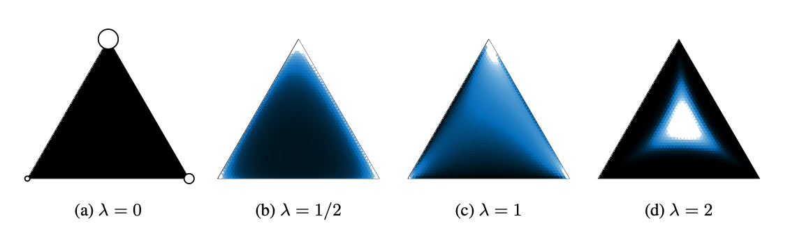

Bad news: since we have the temperature parameter, we will need to do some hyper-parameter tuning: initialize $\lambda$ and then gradually decrease it. And this tuning is not quite easy. More than that, Gumbel-softmax has more serious issue, the major shortcoming caused by the introduce temperature hyper-parameter:
```{marginfigure}
There are many other issues like vanishing gradient and high variance estimate, etc, but we will stop here.
```

* First, using a low temperature causes numerical instabilities. Division by near-zero values naturally leads to numerical instability. This issue is mentioned in the original concrete distribution paper by Maddison.
* Second, to avoid instability, we need to set the temperature somewhere large. The temperature is usually set to 0.5 or larger. This becomes problematic because you intend to get close-to-discrete values, and setting a high temperature only leads you to a relaxed surrogate that is far away from discrete values.

Anyway, Gumbel-softmax is a must try if you intend to do something with a categorical parameters, at least as a very strong baseline.

## Straight-through estimator (STE)

Straight-through estimator (STE) is widely used in binary neural network, whose parameters take value in  $\{-1,1\}$.

In fact, we also see binary neural network as a interesting block with discrete parameters, it is just not so interesting. But the good thing about STE is that it is conceptually simple while still being state of the art. Even after many years of research on binary neural networks, most of them, if not all, are based on STE, while their improvement seems to be tiny and more likely an engineering result.

Straight-through estimator (STE) is first proposed in Hinton's course lecture, and later more formally analyzed and evaluated by @bengio:2013:estimating.

STE goes like this, it still maintains a continuous parameter, but only threshold into binary values in the forward computation. Since what is actually being optimized is still a continuous one, usual continuous optimization methods like SGD/Adam still apply.

In the forward pass, we binaried $w$ into

$$ \hat{w} =
     \begin{cases}
         1, & \text{if  } w > 0.5 \\
         0, & \text{otherwise}.
     \end{cases}
$$

Note that $\hat{w}$ is used for computing the objective function in the forward pass, but in the backward pass, the gradient is updated to $w$. That's it, quite simple right?

Though the theoretical analysis of STE remains hard and not so much progress has been made, application of STE is very wide and has gained many success.

## Binary Optimizer (Bop)

So far, all the methods we introduced maintains a latent continuous parameter and thus optimization is straight forward. Standard optimization methods like SGD or Adam can be employed with no difficulty. One might ask, can we start making a new optimizer that directly optimize discrete valued parameters?
The answer is yes and I will now introduce the Binary Optimizer (Bop) by @Helwegen:2019:rethinking

```{marginfigure}
The Bop is originally developed for binary neural network with parameter value in $\{-1,1\}$. To be consistent, we will suit into the case of $\{0,1\}$
```
Bop uses gradient as the learning signal and flips the value of $w \in \{0,1\}$ only if the gradient signal $m$ exceeds a predefined **accepting threshold** $\tau$:
$$
w =
\begin{cases}
   1-w , & \text{if } |m| > \tau \text{ and } ( w=1 \text{ and } m>0 \text{ or } w= 0 \text{ and } m<0  )  \\
   w, & \text{otherwise}.
\end{cases}
$$
where $m$ is the gradient-based learning signal computed in the backward pass.

A non-zero $\tau$ is introduced to avoid rapid back-and-forth flips of the binary parameter and we find it helpful to stabilize the learning because $m$ is of high variance^[There are many reasons, one is that the gradient is computed on a randomly-sampled mini-batch.].
To obtain consistent learning signals, instead of using vanilla gradient $\nabla$ as $m$, the exponential moving average of gradients is used
$$
m = \gamma m + (1-\gamma) \nabla
$$
where $\gamma$ is the exponential decay rate and $\nabla$ is the gradient computed for a mini-batch. ^[A typical choice of these hyper-parameters including our neural DNF work is $\gamma=1-10^{-5}$ and $\tau=10^{-6}$, while tuning the configuration of $\gamma$ and $\tau$ can be founded in the original Bop paper]

## A slight improvement: STE/Bop with adaptive noise.

This STE/Bop with adaptive noise solution is developed during our work on learning Neural DNF.

We tried STE and Bop and find it does not work. Because of the DNF function is non-concex, optimization is very sensitive to initialization and hyperparameters and can be stuck in local minima very easily.
When stuck in local minima, the gradients w.r.t $w$ effectively become zero, and thus any further updates for $w$ are disabled, because gradient is all zero!
We suspect the reason is that even the DNF function (the differentiable version) is well defined on $[0,1]$, since the choice of values of the binary parameters $w$ can only take $\{0,1\}$, then the loss surface is non-smooth and thus the optimization becomes hard.

Using continuous surrogate does not get stuck in local minima, but it is not guaranteed that in the end we can obtain binary values.

Using temperature-augmented surrogate or gumbel-softmax  works, but tuning temperature becomes another tedious job and surprisingly the convergence is slow because convergence is almost determined by how we gradually increase(or decrease) the temperature hyper-parameter per epoch.  

In summary:

* Using continuous surrogate $\rightarrow$ optimization is okay like any continuous valued blocks, but no guarantees on binary values.
* Using STE/Bop $\rightarrow$ stuck in local minima, and then all gradient be zero, thus learning fails.
* temperature-augmented surrogate/Gumbel-softmax $\rightarrow$ computational cost and tuning temperature is so difficult. The convergence is determined by how we do the temperature schedule

We ask if we can get a simple solution that avoids the drawbacks of all these alternatives. And yes, STE/Bop with adaptive noise is a simple modification and it works great!

We start by noticing the fact that even the parameter of interest can only take $\{0,1\}$,  the differentiable version of DNF is well defined on $[0,1]$.
STE/Bop with adaptive noise goes by perturbing the binary weights $w$ during training by adding noise in the forward pass, so that the perturbed $\tilde{w}$ lies in $[0,1]$.

Specifically, for every parameter $w$ we utilize a noise temperature parameter $\sigma_w \in [0,0.5]$ to perturb $w$ with noise as follows:
\begin{equation}
\label{eqn:perturb}
\tilde{w} =
\begin{cases}
    1-  \sigma_w \cdot \epsilon & \text{if } w=1  \\
    0 + \sigma_w \cdot \epsilon & \text{if } w=0
\end{cases}
, \text{ where } \epsilon \sim \text{Uniform}(0,1)
\end{equation}

In training time the perturbed weight $\tilde{w}$ is used in the forward pass computation of the objective function; in test time, we simply disable this perturbation.
In order to force $\sigma_w$ lies in range $[0,0.5]$, we clip $\sigma_w$ by $\sigma_w$ = $min(0.5,max(\sigma_w,0))$ after evey mini-batch update.
Note that $\sigma_w$ is not globally shared: we have a $\sigma_w$ for every $w$.

We call it **ADAPTIVE** noise because we make $\sigma_w$ also a learnable parameter. We simply initialize $\sigma_w$ = $\sigma_0$ and optimize $\sigma_w$ by SGD/Adam as well. The choice of initial value $\sigma_0$ requires heuristic: $\sigma_0$ cannot be too large as optimization will be slower,
and $\sigma$ cannot be too small as in the extreme case, with zero noise the optimization will constantly fail (at least for the Neural DNF case). We find values between $0.1$ and $0.3$ all work fine and we use $\sigma_0=0.2$ as the default initial value.

`r sans_serif('This is good news!')`  In this way, we do not have to do the tedious job of temperature scheduling! The noise temperature can be optimized by SGD/Adam! It does not get stuck in local minima and gives you directly discrete parameters!

Note that adaptive noise can be applied to both STE and Bop.

For starters, we evaluate on a synthetic dataset on learning Neural DNF.
```{marginfigure}
We use a synthetic dataset
 which consists of 10-bit Boolean strings
and use a randomly-generated DNF as ground-truth.
```
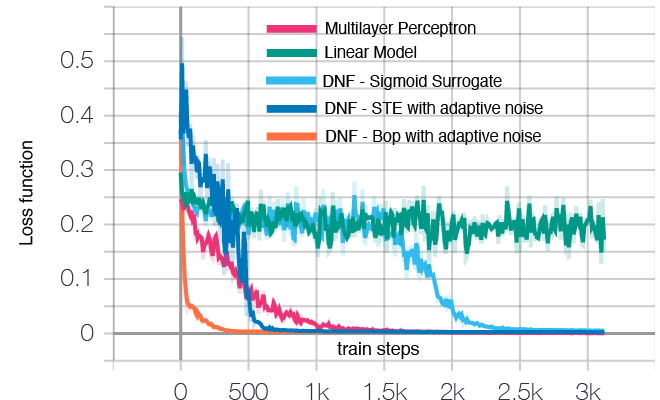

```{marginfigure}
LP and MLP are not DNF functions but only serve for comparison of convergence speed here.
We do not show results for merely STE or Bop because learning always fails. Also, the convergence of Gumbel-softmax/temperature-augmented is determined by the temperature schedule, this means with clever tuning we can fake any curve as we like. So we are not showing them as well.
```
We compared the convergence speed with the following baselines:

* A Linear Model (LM).
* A multi-layer perceptron (MLP).
* DNF - Sigmoid surrogate
* DNF - STE with adaptive noise
* DNF - Bop with adaptive noise

We can see that Bop/STE+adaptive noise both give decent convergence speed while Bop+adaptive noise  is the best.
The synthetic dataset is constructed with a ground-truth DNF, so the linear model does not converge.
As for the reason of slower and less stable convergence of STE+adaptive noise, we believe it is because that unlike the modified Bop, STE does not have the mechanism to prevent rapid flipping and thus optimization becomes more unstable.

`r sans_serif('More theoretical understanding?')` Bop/STE+adaptive noise seems to be a practical solution, while lacking theoretical understanding. My unexamined idea is that maybe we can interpret this adaptive noise as approximate variational inference (the local reparameterization trick by @kingma:2015:variational). In particular, the variational Adam (@khan:2018:perturbation) is very like ours, except they works for continuous values and we add noise as for binary parameters. But anyway, I am so far not heavily trained in probablisitic modelling, so I will stop here and leave this to someone else who are interested.


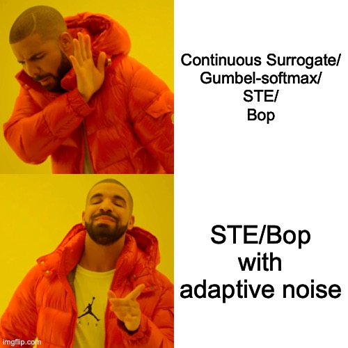

# Beyond: in the sea of possibilities

At the end,  I would like to name a few other possibilities.


## Discrete component in objective functions
We can think of discrete parameters not just in forward computation, but from a regularization perspective. This is, discrete parameters can also be used in regularizations. This sometimes should be of particular interest. For example, in a normal fully-connected layer, we can define a regularizations on $L_0$ norms. For example, in @Louizos:2017:learning, the Gumbel-softmax trick is utilized to train a sparse neural network by the penalty of $L_0$ regularizations.


## More other interesting blocks with discrete parameters.
We have many unexplored blocks (for some specific application) that may use some discrete parameters.

First, remember that the neural architecture search problem is essential a graph-learning problem, and it can formualted in optimizing a binary matrix. This certainly applies to other possible blocks with a graph-like structure. This can even be extended to the case of learning involving any structures.

Second, another possibilities is to learn a program as an block (I list the works of  @Gaunt:2016:terpret, @Gaunt:2017:differentiable and @Valkov:2018:houdini as reference). This is sometimes called differentiable program induction.
The problem is simple, given input-output examples, we try to learn a source code program whose execution maps input to the desired output. The program language can be specifically designed to be differentiable.
```{marginfigure}
**One thing worth mention** about the TerpreT paper by Gaunt et al 2016 is that, it proves that learning program by continuous surrogate is not so sucessful. It sounds like a pessimistic result but it does not test with the other alternative methods I introduce today, such as the Gumbel-softmax, STE, Bop, or the STE/Bop with adaptive noise.
```

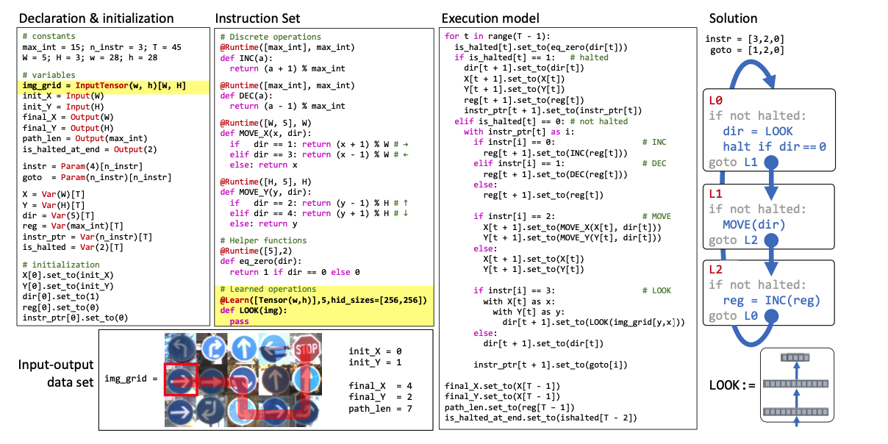

Using gradients for learning such program has a advantage that if the input of the program is the output from another network, or if the program also contains continuous parameters, then the program and the network can be optimized jointly by gradient.

I believe that this direction is fundamentally important, even by now it is not so hot and popular. Reasons as follows:

* we can actually put many human knowledge on the form of programs we want to learn so to provide strong inductive bias.
* it gives a clear, transparent, interpretable program as output.
* more than that, if we can train it by gradient, then can be integrated with other deep learning modules.

This approach of integrating symbolic programs and neural networks is what I saw as future.
I personally hold strong faith that this direction will be practically useful and fruitful in the long run.

# Conclusion

It has become a quite long post, so I will conclude in brief with key take-home messages:

* Thinking in more interesting blocks, instead of conventional blocks such as fully-connected, convolutional layers, should open some possibilities on building advanced deep learning models.
* when you come up with a block with discrete parameters, it is better to think of a differentiable version. Because this way we can get more efficient learning that we can jointly learn discrete and continuous parameters at the same time.
* We introduced several alternative methods like continuous surrogate, gumbel-softmax, straight-through estimator (STE), Binary Optimizer (Bop), and a slight improvement STE/Bop with adaptive noise.

> And they say making a meme of your take-home message is more effective.
> `r quote_footer(" --- I just made it up.")`

::: {.fullwidth}
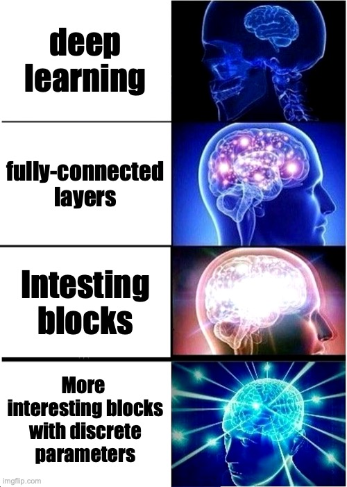{height=243px} {height=243px} {height=243px}
:::
