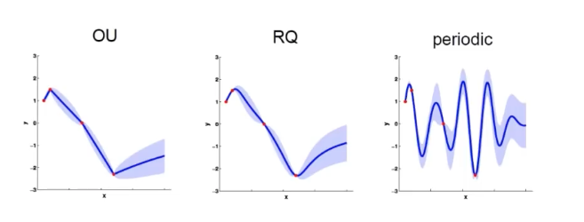
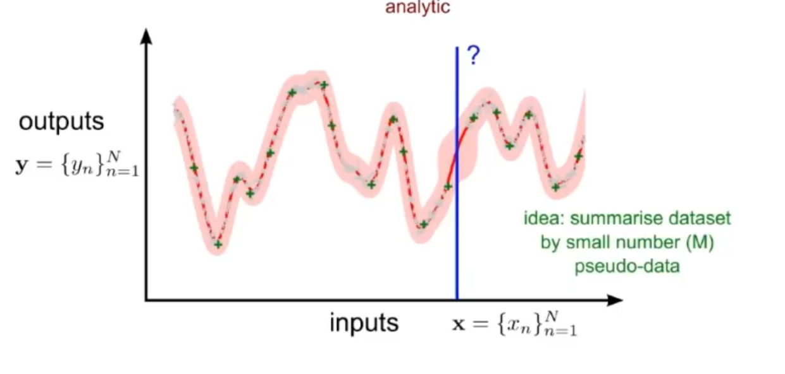

```{r setup, include=FALSE}
library(tufte)
# invalidate cache when the tufte version changes
knitr::opts_chunk$set(tidy = FALSE, cache.extra = packageVersion('tufte'))
options(htmltools.dir.version = FALSE)
```

Jialin Lu [luxxxlucy.github.io](https://luxxxlucy.github.io/)

Oct 14 2020

<!-- `r sans_serif(
"This is first given as a tutorial presentation at on the lab meeting of Martin Ester's group, at Simon Fraser University, 14th Oct 2020 and modified based on following feedback
")
` -->

This page should be mobile-friendly. Slide can be found [here](./slide.pdf).

* The original plan is to introduce and explain an interesting paper that I read. But then I realized that I need to further introduce the the underlying motivation and logic of the proposed approach, and the implications of it: that it could have applications in many tasks.

* The main workflow is to accompany the deep neural network with another model that has some properties that particularly are suited for the task of interest. There will be many choices of what kind of the accompany model (depends on the task), and what this accompany model should do (also depends on the task).


<script>
  // Move TOC to the Table of Contents heading (with id "table-of-contents")
  $(function() {
    $( "#TOC" ).insertAfter( $( "#table-of-contents" ) );
  });
</script>

# Introduction: the price of control

<!-- ```{marginfigure}
 
  <br>
  Freely assemble customized blocks is part of the fun of deep learning, if not all.
``` -->

Naturally, things comes with price, and this is even more true in machine learning.

> Essentially, all models are wrong, but some are useful -- George Box

But more importantly, the aspects different models are useful at are usually different


Usually, a good and successfully application cannot be made by one model; you carefully consider the trade-off and you make decision on which price to pay; but in principle, there is possibility that you can somehow make the best of both, or all models: by some hybrid model.


<Continual Deep Learning by Functional Regularisation of Memorable Past> https://arxiv.org/abs/2004.14070 and the previous work <Approximate inference turns deep networks into Gaussian processes> https://arxiv.org/abs/1906.01930 These works are by Mohammad Emtiyaz Khan, the one who gave a tutorial about bayesian deep learning at NeurIPS 2019 last year. (as I remember, you and oliver has been at that tutorial session)


Anyway this is a quick summary of the paper and the overall methodology that I want to present at the lab meeting. I believe this should be potentially useful for a lot lab members.

Gaussian-process: predicts based on samples, called the functional space.

DNN: works based on parameters, called the weight-space.

## Why we need control in deep neural networks

## How about a hybrid models

Introduce the tree of categorization.


Introduce each of the decision in this tree.


## The Weight- and Functional-space

Funcional and weight, demonstrate in the curve fitting.

A parametric model.

```{marginfigure}
 
  <br>
  The effect of different choices of kernel function. From left to right, a Laplacian, Quadratic, and periodic (sinusoid).
  Credit: Richard Turner.
```

Now there are many things we can do.
1. explore and automatically the kernels
2. Since it is based data samples, we can do something with the data, we can summarize the data globally or locally.

```{marginfigure}
 
  <br>
  In order to perform prediction, we do not have o compute exactly all the data, we only have to pick up a small subset of the data sets that can summarize what that is OK.
  Credit: Richard Turner.
```

But then, how to best summarize then becomes a problem.

Also there is another way that we do not attempt to do this thing in a whole, but rather try to split the dataset into many local clusters, and then for each clusters, we pick up some data points and make predictions based on them.


Bad things, compared to neural networks:
1. scalability, when have many data.
2. Although has ways of automatic construction of kernels and dataset-summarization, it does not work well like DNN that can do end-to-end representation learning like in big image datasets. Does not learn a hierachical structure.

What is the benefits?
1. Well-calibrated predictive uncertainty. DNN has over-confident predictions.
2. A rich of things you can do to the model and to its data, because all the parts have a probabilistic formulation and one can do many things. Why?

This is because X -> \theta -> y. You can inspect the parameters, but what does it mean? No clue.

## What can this approach be applied?

This approach, basically is based on a transformation of a usual deep network in weight-space, into the funcitonal space.

Generally, tasks that needs some notion of uncertainty.

1. Continual Learning
2. Active Learning
3. Transfer Learning, or data efficient learning in general

## The main paper to explain: apply this weight-function conversion with application to continual learning
### Continual Learning


Of course there are actually many previous papers taking this approach but they tend not to work so well. While this should make sense to work better, functional-regularization does not come on par with weight-regularization.


Basically it talks about the transformation of DNN and gaussian process.

(Gaussian Process, which can be thought as an advanced K nearest neighbour, is a non-parametric method that predicts by utilizing existing data samples. )

The logic goes as follows:

1. The paper <Approximate inference turns deep networks into Gaussian processes> talks about how to convert a DNN into a Gaussian Process.
2. And since the gaussian process works on data samples, we can use to identify several critical data samples, for example, data samples that are near the decision boundary.
3. And then comes the new paper <Continual Deep Learning by Functional Regularisation of Memorable Past>, in terms of continual learning where forgetting is a problem, we convert a DNN into GP, use GP to identify some critical samples, and then we can add a regularization function so that we regularize it to produce similar outputs for these critical samples. We then use this new regularization function to train many new mini-batches of the DNN.
4. The ability of this approach has been done by this research Khan in continual learning. But it actually opens up a lot possibilities for other tasks, like active learning (like Oliver's work), or transfer learning (like Hossein's work). Because, in many aspects, a lot of things become much easier and intuitive to understand.


the problem is very simple the GP  is defined on all the data samples which is not so scalable so in order to make it scale we need to use a subset of the samples.

This paper proposes a method and evaluate its effectiveness that you can actually perform better in the weight regularization methods

## Other possibility

### Active Learning

In particular. for active learning. why this DNN-GP hybrid approach can be useful be active learning?

1. The overall workflow of active learning relies on a uncertainty measure. The current Bayesian NN are like Monte Carlo dropout. This is not even as good as deep ensemble. Converting it into a GP and use GP to measure uncertainty is
    1. Should be more correct, in terms of the uncertainty measure.
    2. The measure of uncertainty also becomes easy, because GP has a probabilistic formulation.
2. By using the GP to find several important samples, and put these samples's prediction value as regularization.
    1. Is more natural,
    2. And is indeed a more traditional way of doing it. This means there a lot of ways in the literature.
3. The only problem is the computational cost.
    1. I think in the paper the author provide some way to do this very efficiently, by somehow converting the GP on the run with mini-batch update. (I am still not super sure about it, but if we can make it efficient, then computational cost may be nothing).
4. Open up possibility not just for continual learning. But
    1. Active learning
    2. Data-efficient learning
    3. Transfer learning

### Transfer Learning, or data efficient learning in general
Now in transfer learning, what I see as a very important thing is what is actually transferred.
It is better for a transfer learning model to actually state clearly, what is transferred and what is not.

In deep learning, this is hard, because the distribution representation we use, a dense vector that is said to a be a good represention/compression of the original data sample.

### OOD detection and prediction

## At last, some retrospective opinion.

1. Does it have to be a Gaussian Process? Not necessarily. We can also fit another model as long as it can approximate the posterior distribution well then it's OK of course this will lead to choirs to compare a lot of alternative approaches they can do well, as long as we can find a good one that can support us to do some very new school since then it's OK

## What can be done.

Do you think that's what


deep learning is good it's great but deep learning is only good in the things because feature extraction all representation learning, or simply the dimension reduction.

When we talk about the applications especially in the medical domains with a small dataset that is not so much like natural images, morning that people are so desperately want to get useful knowledge that can be explained by the domain community.


1. We can use
2. We can also think about how to improve weight-space model based on the things we can do for function-space model, simply by checking the literature for of people devise and improve a functional-space model


1. Sparse Gaussian Processes using Pseudo-inputs
2. A Unifying Framework for Gaussian Process Pseudo-Point Approximations using Power Expectation Propagation

### Other important reference material

* A good introduction for Gaussian Process. Chap-6.4 on Gaussian Process. <Pattern Recognition and Machine Learning>, *Christopher Bishop*
