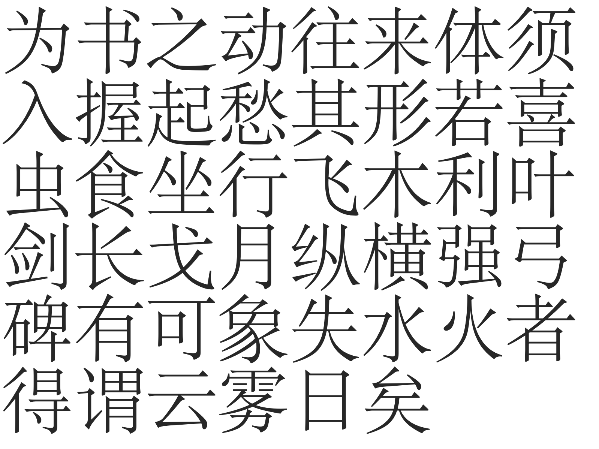
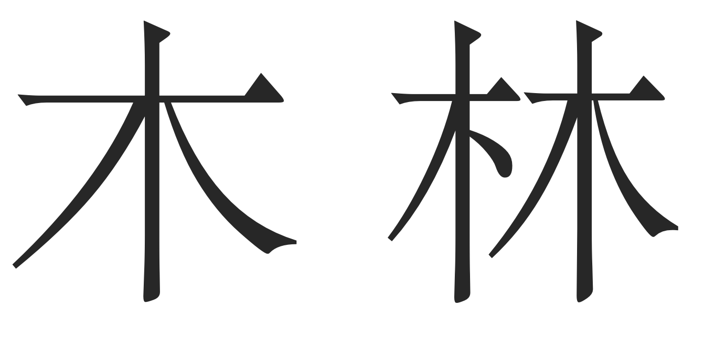

# A Review of Failure - Deep Generative Model for Chinese Fonts

Created: November 29, 2019 2:44 PM

<aside>
👉 Written by *[Lucy* Jialin Lu](https://luxxxlucy.github.io/), Nov 30th 2019. This is a review of a failed project.

</aside>

I started this project, namely deep learning for the generative modeling of Chinese Fonttype, two years ago when I interned as a research assistant at the University of Hong Kong working with Prof. Li-yi Wei. The essence of this project is to learn a generative model for Chinese Fonts with a hope of the flexibility and premise of deep learning. I spent a lot of time, tried a lot, even a long time after the internship but this project unfortunately failed. Frankly, it failed out of three reasons:

1. The first reason is that I tried a lot of methods but didn't result well.
2. The second reason is simply a personal matter: I am now doing my master's in Canada on a different topic so I do not have extra time on this. So I have to pause to work on this anymore.
3. The last reason is that Li-yi also gradually lost interest in this project, partly because of his new job, partly because of the limited-or-next-to-zero research output from me.

So you can see that in fact, it is entirely my fault. All this happens because I failed to produce a reasonable POSITIVE research output. 

But from the failures, I also began to understand the real obstacles to this problem. The painful and bitter lesson is: if we really wish to tackle this hard problem of learning a generative model for Chinese fonts, there are **three key challenges** that we inevitably need to conquer. Thus here in this post, I will summarize the three key challenges I found, during my failed quest for the generative modeling of Chinese fonts. 

This post is more or less intended for interested researchers and the future me, because soon or later I will come back to it (at least I hope so). I always have a mania on Chinese fonts. My father is a calligrapher specialized in Wei-Bei (魏碑, roughly the calligraphy works of the northern dynasties between AD 420–589) and makes a living for our family by it. I myself studied calligraphy, specializing in [Zhao Mengfu](https://en.wikipedia.org/wiki/Zhao_Mengfu) and [Chu Suiliang](https://en.wikipedia.org/wiki/Chu_Suiliang), and I've twice made it to the national prize exhibition of young calligraphers, although due to many reasons I've been away from my brush pen for a long time since the beginning of college. Anyway, I still think it is highly likely that I will resume this failed project.

A glimpse of contents:

## Three Key Challenges

---

The three key challenges I found, of the generative modelling of Chinese fonts are:

1. Key challenge #1: **A font consists of glyphs (for each character) which are represented as vector images**, instead of the more comfortable pixel images. In particular, we say each glyph is parametrized in Bezier curves.
    
    However, current methods almost only work properly for pixels (raster images). How to handle the unordered, not-fixed-size, irregular representation of data is still an [open challenge](https://www.sets.parts/) for deep learning. Pre-training in pixel image and then transferring to vector image seems to be currently the best practice. But this is far from satisfactory.
    
2. Key challenge #2: **The Chinese language has an extremely large alphabet**. Any working font for commercial use will need a collection of at least 6000~7000 glyphs (the complete alphabet will be more than 40,000). This does not even count some other critical issues, such as 
    - A tricky phenomenon called [Variant Chinese character](https://en.wikipedia.org/wiki/Variant_Chinese_character) (异体字) which are different glyphs for the same character such as 飃&飄, 嶋&島,  回&囘&囬. They are technically the same thing, but just in different appearances
    - Different glyphs for the same character for traditional Chinese and simplified Chinese, or even Japanese [Kanji](https://en.wikipedia.org/wiki/Kanji). It means the alphabet needs to be at least 1.5 times bigger (roughly).
    
    Current methods struggle to work for a fixed small size of glyphs, such as the Latin alphabet. Scaling up to 6000 glyphs seems to be computationally infeasible.
    
3. Key challenge #3: **The compositional nature of glyphs**: The reason why the Chinese font has a large alphabet is that Chinese font is compositional. One glyph might consist of many "parts" and any parts can be re-used to form different glyphs. Parts are composed into a glyph following some aesthetic principles. This is also what happens in the design studios of Chinese font designers. Designers would first come up with 
    - a collection of basis "parts" and
    - a collection of important glyphs that give the aesthetic principles on how to compose "parts" into a glyph.
    
    Chinese glyphs are, by a large margin, more complex than Latin characters. My opinion is that explicit consideration of compositionality will be essential. It seems that we need a more "model-based" network rather than a "model-free" network (like the notion of model-based RL methods and model-free ones). A proper new architecture with inductive biases that can handle compositionality is desired.
    

Note that the first challenge of vectorized representation is not only for Chinese fonts but rather for general fonts including other languages such as any Latin-based alphabet. The latter two challenges are specific properties of Chinese characters.

## Challenge#1 The vector representation of glyphs

---

The vector representation of font glyphs is a real obstacle where current architectures do not give a good-enough performance.

TL,DR:

- Too many works claim to solve font, but in fact only deal with raster images, which is not useful and not cool at all.
- For those works which treat fonts as vector images, the deep learning architectures they used do not work very well. Most of them are variants of RNNs in order to handle the non-fixed-sized, very flexible representation of bezier curves. Hard to train, poor and unstable performance.
- But since we are relatively more comfortable with raster images anyway (thanks to CNN), a two-stage approach, which first pre-trains in raster images and then somehow transfers to output vector images, seems to be the currently best solution.

### One should consider vector images for fonts, not rasterized ones.

Fonttype is not normal regular images. We have reasons for using vector representations as font designers and the industry think it has nice properties: it is clean and concise with no noise, it does not consume large storage (up to a few MBs), it can be rendered at different scales.  Of course, certain designs will look less beautiful at certain scales (for example, not so good-looking when scaled too large, or not recognizable when scaled too small) and rendering glyph is also a hard job but that is the job of designers and engineers.

As long as a good font is designed put into commercial use, the vector representation makes it really useful and is clearly superior to raster ones.

<aside>
👉 Of course, to treat font glyphs as a set of strokes was also once a popular idea. But now I have a feeling that most of stroke-based methods are not popular anymore. They certainly make sense for hand-written characters, but not the real fonts which are DESIGNED. I hold firmly the idea that the bezier parameterization is the one and only choice.

</aside>

When we consider generative modeling of font, we must use the vector representation (the bezier parameterization) instead of the rasterized image. I found too many works tried to do something on fonts but only dealing with the pixel representation (usually the rasterization is done by pre-processing or even sampling at multiple scales as pixels) and then claim to solve the generative modeling of fonts. Most of the time, the popular GAN is the choice of the generative model, some examples:

[Transfer Your Font Style with GANs](https://bair.berkeley.edu/blog/2018/03/13/mcgan/)

[GlyphGAN: Style-Consistent Font Generation Based on Generative Adversarial Networks](https://arxiv.org/abs/1905.12502)

[FontGAN: A Unified Generative Framework for Chinese Character Stylization and De-stylization](https://arxiv.org/abs/1910.12604)

All these seem to be solid works, but I do not see anything interesting, or whatever is unique for fonts rather than general images.

### Current generative modelling methods are not good.

Speaking of the choice of generative modeling, GAN and VAE are the two ubiquitous choices. But first I  would like to talk about the actual output part for vector images, which most of the time is a mixture density network as the output layer, 

[Mixture density networks | Semantic Scholar](https://www.semanticscholar.org/paper/Mixture-density-networks-Bishop/4cf3569e045993dfe090749f26a55a768684ab86)

the main purpose of which is to output the parameterized distribution: a subset of neural network output for mixture weights of components, and another subset of network output for an individual component. I am not sure who made this idea really work in the real-world applications in the first place, but based on my knowledge, I think mixture density output became a hit thing in deep learning research — being famous and widely acknowledged and recognized, and widely cited — in Alex Grave's famous paper on generative modeling with an RNN, to be precise, an LSTM. 

[Generating Sequences With Recurrent Neural Networks](https://arxiv.org/abs/1308.0850)

This should form the basis on how to treat irregular output (output that is other than pixel values) for vector images. I do not have any opinion on mixtue density output layer. It is just as it is. The good and bad thing of it is that it has some randomness in it, which is totally okay for hand-written characters. But for fonts? I don't know.

But anyway let us get back to the main track of problem, the non-fixed-sized flexible representation of font glyphs 

- a glyph consists of a single part like "一" or multiple parts like "二“
- a part can be a contour, for example, the Latin character "C" and Chinese character "一", which is just a single contour
- a part can be a nested collection of multiple contours. It can have one outside contour such as "A" and "口", and multiple inside contours such as "B" and "日". I call it the **one-outside-contour many-inside-contour phenomenon.**

To handle this representation, the straightforward way could treat it as a sequence, using an LSTM, or other RNN-variant. For example, a bi-directional LSTM 

[A Neural Representation of Sketch Drawings](https://arxiv.org/abs/1704.03477)

(Note that this paper does not work on font glyphs, but rather just vector image with no notion of contour.)

Why use bi-directional LSTM? I guess it is simply because gives better results than just a single-directional LSTM. However, is any RNN-variant a good solution? I would probably say no, because RNN is only a simple way to handle non-fixed-size input and the font glyph does not even exhibit a temporal structure! The spatial relationship of different parts of the glyphs, of course, can be regarded as some sort of temporal relation, but this is so lossy and unelegant a solution!

1. All RNN-variant method would have long term dependency issues, thus some aesthetic constraints on the output may be very difficult to achieve, for example, in the character "三", we wish the vertical interval space of the upper two strokes and that of the lower two strokes to be roughly equal. This can be very hard to ensure in the RNN framework as the inevitable gradual forgetness of long term dependency. 
2. The notion of the contour is difficult in RNN. A contour is a circular list. It indeed has some order but it has no "start point" or "endpoint". Any node in a circular list can be a start and endpoint. Bi-directional RNN can be an easy solution but by no means a good one. 
3. We do not even mention the **one-outside-contour many-inside-contour** phenomenon. The bi-directional RNN techniques can be used in other data, such as circular RNA where its use makes more sense. But really, I do not think it really is interesting applying it to fonts.

<aside>
💡 A natural guess — and perhaps an educated one — is that many attention models are better suited in this case than RNN-variants. But will a blind force application of transformer in Chinese fonts really give a dramatic performance upgrade? No. At least from my experiment, I say no. And from my reading, I haven't seen any compelling and convincing, robust observations for switching to attention.

</aside>

### Better architectures: A possible future

The clear lesson I learned is that we need a better-suited architecture which can handle non-fixed-size data (vector images), and also make sense on the property of font glyphs. One possible and interesting paper I know is the recursive cortical networks.

[A generative vision model that trains with high data efficiency and breaks text-based CAPTCHAs](https://science.sciencemag.org/content/358/6368/eaag2612)

[Common Sense, Cortex, and CAPTCHA](https://www.vicarious.com/2017/10/26/common-sense-cortex-and-captcha/)

It proposes to explicitly perceive the contour and the surface content separately and use a neuroscience-inspired way to construct multi-level hierarchical architecture. 

<aside>
💡 The focus of this RCN paper is on data-efficiency. Further careful investigations on glyphs can be exploited.

</aside>

The deep learning community is advancing so rapidly these days. New architectures come up every day. It is possible that that specific architecture we want has already be in the sea of papers and it is just we do not realize the importance of it. Highly likely. Or maybe, that architecture will be re-invented in the future, as what had happened many times. But in general, I am optimistic that in the future we will witness the development of better new architecture. 

At that time, the task of generative modeling of Chinese fonts can be an easy cake and I will for certain come back for it.

### The currently best solution: pixels as extra information.

But now let us forget about the optimism of future, and talk about the currently best "greedy" solution. Let us look at the current situation:

- Since we are after a generative model, we want vector image as the output.
- Current architectures works well for pixels, but not vector images.

Then there are mainly two options:

1. use the pixel image as extra information to learn a generative model.
    
    This is what I did once, but not so thrilling result .
    
2. learn a generative model that works on pixels, and then transfer to vector images.
    
    I found Lopes et al 2019 to be doing this, will explain later.
    

**Use the pixel image as extra information to learn a generative model:**

I did this as the last attempt for this project. Namely, use the pixel image and the vectorized representation together.

I use a VAE with U-net connections. The input is augmented, I use multiple pixel images of a glyph (sampled at multiple scales) and plus the vector image. CNN is used for the pixels and an RNN (bi-directional LSTM) for the vector part. I will say it works under mild conditions, around 50 characters of less than 100 fonts but becomes difficult to assess for more characters. ("Hard to assess" refers to the last finding below.)

Findings:

- We have CNN for the pixel image part and it dramatically improves the performance. And the training becomes more stable and reproducible.
- The choice of RNN becomes strange. Using larger and deeper RNN does not improve the performance so much. One can naturally doubt if RNN really learns in an efficient way and clearly the RNN is not trained to the maximum capacity of its expression power.
- The choice of characters also matters. I handpicked characters which are easier to learn but still cannot do well for more characters. Since I train the VAE in a progressive manner (gradually increase the number of characters), When it reaches more than 50 characters,  the visual result start to degrade, heavily.
- The style of different fonts does not preserve consistently. Some special-styles (outlier fonts) only have terrible looking reconstrunction.
- But the most major and frustrating problem is not that the reconstruction does not look well visually. But that the reconstructed sequence does not even work as a valid bezier parameterization! There are many times that the resulted sequence cannot be rendered at all. In this case, the reconstruction completely failed.

<aside>
💡 The "performance" mentioned is literally my visual examination of the reconstructed result of the font glyph.

</aside>

And not to mention that, reconstruction in VAE framework is only the first step, I did not even touch the style-content transfer thing.

L**earn a generative model that works on pixels, and then transfer to vector images.**

The other approach is to first train in pixels and then somehow transfer to vector images. This is what happened in the following paper. It trains a character-conditional VAE on pixels and then, freezing the weight of encoder, and train a new decoder outputting sequences which represent the vector image.

[A Learned Representation for Scalable Vector Graphics](https://arxiv.org/abs/1904.02632)

I would say the general result is great and I can only imagine the time and effort. But besides that I also have some rather vicious guesses:

- I guess the authors must have tried to model the vector image directly, but somehow failed or not giving satisfactory results.
- I guess the author must have tried to train the model end-to-end instead of separately. But I guess such a non-separate training scheme is not really stable, or cannot be easily reproduced.

<aside>
💡  Just personal opinion, no offense

</aside>

But to be honest about it, even it is a fairly ad-hoc approach, I think this is the best solution we can have now until someone comes up with a freshly simple and efficient Newtonian-like architecture.

## Challenge#2 The large alphabet

---

As I've experiment myself and also what I conclude from existing studies, how to ensure a generative model that work around for less-than-100 characters and less-than-100 fonts to still work for an extremely large collection of characters is a very difficult problem. At least now it is still too early for such massive scale evaluation.

But still, some proposed work make a special consideration on the characters, for example, the character is used as input to train a character-conditional VAE or GAN, or the different characters are stacked together as input (for example, in the very first reference of MC-GAN from Berkeley, every character is explicitly used as a channel of the input image). One can see that following these design

- The network would grow at least linearly to the size of the alphabet.
- Once trained, the alphabet becomes fixed. When new characters come in, there is not a simple way to handle but to modify network architecture and ask for fine-tuning.

As I've mentioned above, 6000 characters are the minimum requirement for a commercial font. And of course, as we are ML researchers rather than real designers we're not expected to accomplish such a grand goal anyway. But still, one cannot ignore the true obstacle here: the extremely large alphabet makes any research claims or statements sound like a plain joke.

## Challenge#3 The compositional nature of glyphs

---

The third challenge, compositionality, touches the nature of Chinese fonts. We have a large alphabet of the Chinese language for a reason because we compose new characters following certain rules. Sometimes based on the composed parts, the meaning of a character can be even guessed almost correctly by any educated adult. 

Now let's first ignore all the asethetic principles on how to compose Chinese characters, now I just describe the basic rules

- Parts are the basis units for composing a glyph (character).
- The composition of parts into a character glyph includes the re-location of different parts into their proper location.
    
    

    
    A collection of commonly-used characters, one can see that excluding characters that is itself a part, most glyphs consit of multiple parts and  all these parts will need to re-locate themselves to form a "greater" glyoh.
    
- The composition of parts into a character glyph also includes the slight adjustment of the parts. Most of the time the adjustment is slight and small.
    

    The character "林' (meaning "forest") consists of two "木" (meaning "tree"). Note that not only a re-location is made to put two "木" at left and right, there are also small adjustments, especially for the left part.
    

The nature of compositionality is a curse but also a blessing. Solving compositionality or at least explicitly think about this property will always helps us in the quest of the large Chinese alphabet.

I consider this a clear message. To handle the large alphabet, why not try to model the compositionality? I believe such a clever modeling of this composition is essential and necessary! However, it is not to do or not to do it that is the important problem here. It is how to do it. Right now, even the simpler task of only do the re-location of parts remains difficult, not even considering the slight modification of parts.

## A practitioner's advice: Shall we consider a restricted real-world task?

---

Generative modeling of fonts has been a fundamental problem, but itself is not a real-world problem. We will need to align to some concrete applications anyway and that's where the difference of methods starts to show and be perceived by people. Thus a piece of practical advice is to look for 

1. Option 1: Solve a sub-task
    - Try to solve only the problem of Variant Chinese characters. This is especially important when the variant character is used in someone's name.
    - Consider a limited version of content-style transfer on fonts.
    - Rather, focus on the mechanism from the human-computer interaction side.
    - Solve the automatic kerning for main-title used scenarios. (This is unconventional for Chinese font to kern, but for the main-title-used glyph, or as long as is not used for long-text, an automatic kerning seems to make sense.

2. Option 2: Consider for aiding the work of real font designer

- Given a small collection of maybe 100 characters, extract certain parts, figure out the essential composition principles, and automatically generate the rest glyphs.
- Growing an acyclic graph for actual font designers. By doing so, one can follow this graph to design glyphs one by one, but in a more guided way.
- Consider the revision-phase of font design: whenever the designer makes a certain modification on a glyph, the same modification should apply to other similar glyphs. In other words, automate the tedious work.

## Concluding Mark

---

Fonts are hard. Chinese Fonts are even harder. Through this little-bit-long post, I mainly summarized the three key challenges and also give a lot of personal opinions. I hope that I can resume this project someday.

## Appendix: A survey of literature I made two years ago, on ML for vector images (not just for Chinese Fonts)

---

Please kindly ignore that this draft starts like a normal paper that it proposes something and make it work. There is no such thing in this draft. But I guess the related work part is still interesting.

[./assets/final.pdf](./assets/final.pdf)
