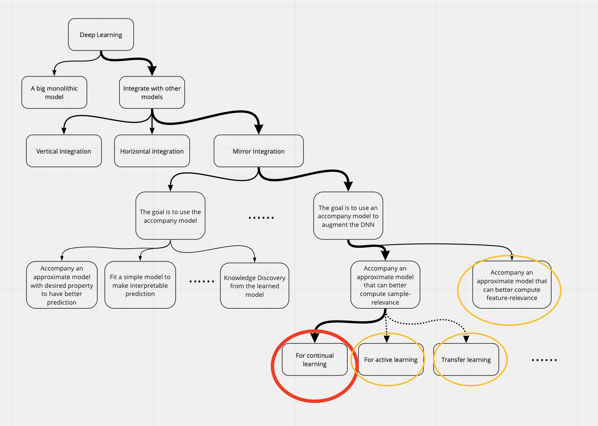
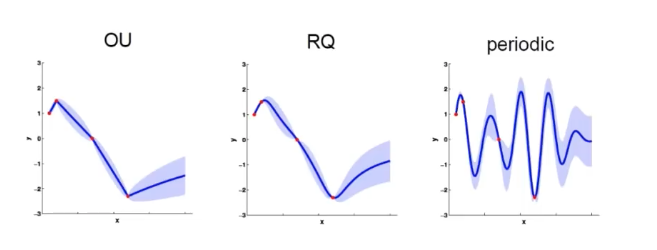
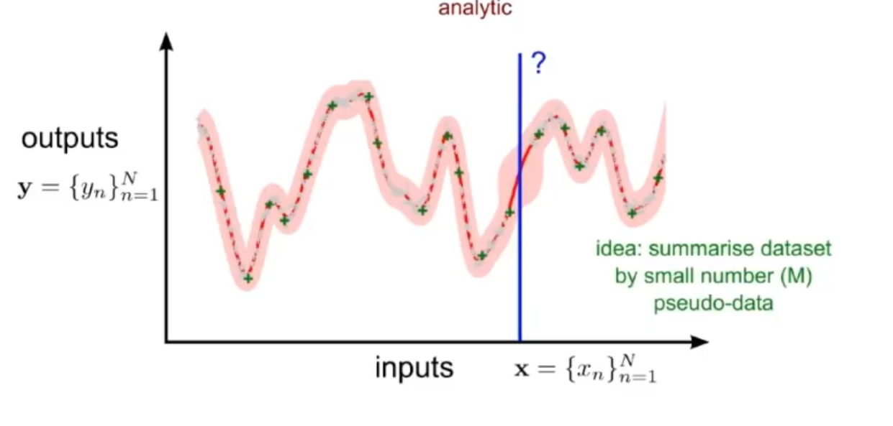

```{r setup, include=FALSE}
library(tufte)
# invalidate cache when the tufte version changes
knitr::opts_chunk$set(tidy = FALSE, cache.extra = packageVersion('tufte'))
options(htmltools.dir.version = FALSE)
```

Jialin Lu [luxxxlucy.github.io](https://luxxxlucy.github.io/)

Oct 14 2020

<!-- `r sans_serif(
"This is first given as a  presentation at on the lab meeting of Martin Ester's group, at Simon Fraser University, 14th Oct 2020 and modified based on following feedback
")
` -->

This page should be mobile-friendly. Slide can be found [here](./slide.pdf).

* The original plan is to introduce and explain a recent paper by @Pan:2020:functional^[accepted at NeurIPS 2020 as oral, the senior author of this paper is [Emtiyaz Khan](https://emtiyaz.github.io) who gave a bayesian deep learning tutorial last year at NeurIPS, I am sure some of my lab members attended and learned a lot.] that I read and found quite interesting. But then I realized that I need to further introduce the underlying motivation and relevant approaches a.k.a the big picture first.
* So I first provide a categorization of a bunch of research works --- hybrid models of deep learning --- that, propose to accompany a deep neural network with a new model which has some properties suited for some task of interest. There will be many choices of what kind of the accompany model (depends on the task and context), and what this accompany model should do (also depends on the task).
* Then two particular keywords within this categorization are introduced with emphasis: **Mirror Integration**^[**Mirror Integration** is a term I made up, meaning to approximate an old DNN model with a new model. Will introduce later] and **Functional Regularization**.^[**Functional Regularization**: there are many things a mirror model that can do (or helps to do better), one in particular is functional regularization, meaning we put regularization in the function-space, instead of the more usual weight-space. Later I will explain and discuss why these two thing mirror integration and functional regularization matter and are very important in deep learning.]
* Under this categorization, this paper by Pan et al 2020 works can be summarized as applying **mirror integration** and **functional regularization** for *continual learning*.  I am also going to discuss possibilities of using mirror integration and functional regularization in other tasks such as active learning.

<script>
  // Move TOC to the Table of Contents heading (with id "table-of-contents")
  $(function() {
    $( "#TOC" ).insertAfter( $( "#table-of-contents" ) );
  });
</script>

# Introduction:

<!-- ```{marginfigure}
 
  <br>
  Freely assemble customized blocks is part of the fun of deep learning, if not all.
``` -->

Naturally, things comes with price, and this is even more true in machine learning.

> Essentially, all models are wrong, but some are useful -- George Box

But more importantly, the aspects different models are useful at are usually different.

Now some of current topics in our group are applying deep learning in bio-medical domains.
While deep learning has certainly gains its reputation on powerful end-to-end feature representation learning, there are many issues, or intrinsic limitations of deep learning. In particular,  bio-medical tasks asks for

* generalization ability: in bio-medical there is often quite significant  distribution shift between test/train set and among different datasets.
* small dataset size and high-dimension input: a typical characteristic.
* predictive uncertainty: well-calibrated uncertainty is certainly important. In particular, it would be ideal to somehow know how 'out of distribution' a particular test sample is.
* interpretability: we are essentially more interested in discovering the underlying mechanisms rather than a good predicting machine.

And given these special things about bio-medical tasks, we are rarely working with a very standard train/test supervised setting, we are often facing the problem distribution shift, transfer learning, cross-dataset learning, etc. Some of the lab members are now focusing on transfer learning, cross-dataset learning and active learning. But it is not easy to do in standard deep learning ways: many things that works in vision perhaps might not work in the datasets of our interest.

In general, deep learning is good in terms of its powerful end-to-end feature learning and its simplicity (backprop and SGD) and it is also true that a lot of things we want can be done in deep learning, but it is not always easy. While there are things that can be more easily done by some other non-deep learning models, models that are perhaps more easy to control and to understand.

Possibility now lies in hybrid models of deep learning, meanign we integrate deep learning model with some different model.

## A categorization and introduction of hybrid models of deep learning

So Today I am going to talk about integrating the deep learning with some other models.
I will introduce a tree of categorization of the works I know and note that the paper (Pan et al, 2020) lies in a leaf node of this tree.
I will start from the root and step-by-step come to the leaf node, during which I will also explain and introduce very briefly about each sibling node.

::: {.fullwidth}

:::

Why not a big monolithic model?

In general, I divide the ways of integrating deep learning into three general kinds:

### Vertical Integration.

I first encounter the term of vertical and horizontal integration in a survey paper for neuro-symbolic methods, but then I find these two terms have older roots in market research, and anyway I start to use these two terms.

Veritical Integration means the we divided a task into multiple stages and then for each stage we use a sutied model. In the end, all these stages are applied sequentially.

Introduce some works in this category.

Also introduce Neural DNF.

### Horizontal Integration

An easy way to thinkg about Horizontal integration is to think about two extreme cases:

One extreme is simply to use a ensemble of multiple models, each model parallelly computes the result and then summarize up.

Another extreme is conditional computation, not execute all the models, but only one of them is computed.

But there can be more delicate designs in between of these two extremes. that different model communicate with each other.


### Mirror Integration

Mirror Integration is a term I made up. It basically means that when you build and trained a deep neural network, and then you apply a different model to approximate the model.


#### Mirror integration type 1:

It then can be further splitted into two cases. The first case is you want to the use the mirror model, that is, the new model is your goal.

##### Mirror integration for better prediction
The simplest and most common scenario is use this model to achieve better prediction.

This includes many works on network distillation. It trains a student network to approximate the teacher network, but since the teacher network gives a soft label, so the student network can learn better than simply learn on the ground truth dataset.

But then the new model does not have to be a neural network, for example, in this work, Improving predictions of Bayesian neural networks via local linearization. It fits a new model based on a pretrained neural network, the purpose is to make a model which has a better predictive uncertainty (while Bayesian Deep nets do not really provide a good uncertainty measure, we will revisit this point later.)

##### Mirror integration for interpretable decision making
This works by fitting a simpler and interpretable model on the pretrained DNN.


Now why this is the reason, despite the soft label issue, we can now apply the active learning setting. Introduce our work

##### Mirror Integration for knowledge discovery from the learned model.

Like the work of Discovering Symbolic Models from Deep Learning with Inductive Biases. It first train a graph neural network, then it tries to fit a symbolic moduel for a part of graph neural network, it fits one by one until.

#### Mirror integration type 2:

The goal in type 2 is to use the new model to augment the original model.

The motivation is that, by choosing the right form of the new model, we can get information and insights, some understanding of the original model, and then we can use such information to guide a better training of the old mode, by adding it as a regularizaton function.

Needs a figure.

I make two kinds of approahces under this category, one that learns a new model that can better compute data-relevance, and one that can better compute feature-relevance. And certainly there are many others.

Now what kind of insights do we need is actually ill-defined and might be hard to understand. And now we are going to introduce and discuss this paper.

There are many things we can do, one way is to use some information from the new model and then change the regularization function, and then use the modified loss function to train the original model.

## Functional Regularization of Memorable Past.

The problem in continual learning: forgetting

### The usual solution: weight-regularization

In this continual learning,

Of course there are actually many previous papers taking this approach but they tend not to work so well. While this should make sense to work better, functional-regularization does not come on par with weight-regularization.

$$L = \sum_{x,y \in D_2} L_{\textit{classification}}(f(x;\theta),y) + \lambda || \theta - \theta_{D_1}||$$


$$L = \sum_{x,y \in D_2} L_{\textit{classification}}(f(x;\theta),y) + \lambda \sum_{x,y \in D_1} || f(x;\theta) - f(x;\theta_{D_1})   || $$


$$L = \sum_{x,y \in D_2} L_{\textit{classification}}(f(x;\theta),y) + \lambda \sum_{x,y \in D'} || f(x;\theta) - f(x;\theta_{D'})   || $$


### The proposed method

<Continual Deep Learning by Functional Regularisation of Memorable Past> https://arxiv.org/abs/2004.14070 and the previous work <Approximate inference turns deep networks into Gaussian processes> https://arxiv.org/abs/1906.01930

The logic goes as follows:

1. The paper <Approximate inference turns deep networks into Gaussian processes> talks about how to convert a DNN into a Gaussian Process.
2. And since the gaussian process works on data samples, we can use to identify several critical data samples, for example, data samples that are near the decision boundary.
3. And then comes the new paper <Continual Deep Learning by Functional Regularisation of Memorable Past>, in terms of continual learning where forgetting is a problem, we convert a DNN into GP, use GP to identify some critical samples, and then we can add a regularization function so that we regularize it to produce similar outputs for these critical samples. We then use this new regularization function to train many new mini-batches of the DNN.
4. The ability of this approach has been done by this research Khan in continual learning. But it actually opens up a lot possibilities for other tasks, like active learning (like Oliver's work), or transfer learning (like Hossein's work). Because, in many aspects, a lot of things become much easier and intuitive to understand.

the problem is very simple the GP is defined on all the data samples which is not so scalable so in order to make it scale we need to use a subset of the samples.

This paper proposes a method and evaluate its effectiveness that you can actually perform better in the weight regularization methods.

Ideally, it does not have to be a Gaussian process, it can be any other Bayesian deep learning model that has an predictive uncertainty.

Such as the naive mean field (on the weights), monte carlo dropout, or deep ensembles.

But then, why using a Gaussian Process?

Simple, for this alternative methods, it can computes predictive uncertainty, but it

## Other possibility

### Active Learning

Now why I think active learning is actually particularly useful for this approach?


Because in continual learning, we can only say that GP has better predictive uncertainty and that the predictive uncertainty is good about finding some useful data samples.

But for active learning, GP is rooted in active learning. It is invented for the mining of gold.

1. It works and predicts on a basis of sample-collecting. This means the update of new collected data samples certainly makes the prediction updated.
2.


In particular. for active learning. why this DNN-GP hybrid approach can be useful be active learning?

1. The overall workflow of active learning relies on a uncertainty measure. The current Bayesian NN are like Monte Carlo dropout. This is not even as good as deep ensemble. Converting it into a GP and use GP to measure uncertainty is
    1. Should be more correct, in terms of the uncertainty measure.
    2. The measure of uncertainty also becomes easy, because GP has a probabilistic formulation.
2. By using the GP to find several important samples, and put these samples's prediction value as regularization.
    1. Is more natural,
    2. And is indeed a more traditional way of doing it. This means there a lot of ways in the literature.
3. The only problem is the computational cost.
    1. I think in the paper the author provide some way to do this very efficiently, by somehow converting the GP on the run with mini-batch update. (I am still not super sure about it, but if we can make it efficient, then computational cost may be nothing).
4. Open up possibility not just for continual learning. But
    1. Active learning
    2. Data-efficient learning
    3. Transfer learning

### Transfer Learning, or data efficient learning in general
Now in transfer learning, what I see as a very important thing is what is actually transferred.
It is better for a transfer learning model to actually state clearly, what is transferred and what is not.

In deep learning, this is hard, because the distribution representation we use, a dense vector that is said to a be a good represention/compression of the original data sample.

### OOD detection and prediction

## At last, some retrospective opinion.

1. Does it have to be a Gaussian Process? Not necessarily. We can also fit another model as long as it can approximate the posterior distribution well then it's OK of course this will lead to choirs to compare a lot of alternative approaches they can do well, as long as we can find a good one that can support us to do some very new school since then it's OK

## Conclusion

Do you think that's what


deep learning is good it's great but deep learning is only good in the things because feature extraction all representation learning, or simply the dimension reduction.

When we talk about the applications especially in the medical domains with a small dataset that is not so much like natural images, morning that people are so desperately want to get useful knowledge that can be explained by the domain community.


1. We can use
2. We can also think about how to improve weight-space model based on the things we can do for function-space model, simply by checking the literature for of people devise and improve a functional-space model


* My general comments is, instead of using a big monolithic deep neural network as in vision and NLP research, we should cons

1. Sparse Gaussian Processes using Pseudo-inputs
2. A Unifying Framework for Gaussian Process Pseudo-Point Approximations using Power Expectation Propagation

### Other important reference material

* A good introduction for Gaussian Process. Chap-6.4 on Gaussian Process. <Pattern Recognition and Machine Learning>, *Christopher Bishop*


### The Weight-space and Functional-space

Functional and weight, demonstrate in the curve fitting.

A parametric model.

```{marginfigure}
 
  <br>
  The effect of different choices of kernel function. From left to right, a Laplacian, Quadratic, and periodic (sinusoid).
  Credit: Richard Turner.
```

Now there are many things we can do.
1. explore and automatically the kernels
2. Since it is based data samples, we can do something with the data, we can summarize the data globally or locally.

```{marginfigure}
 
  <br>
  In order to perform prediction, we do not have o compute exactly all the data, we only have to pick up a small subset of the data sets that can summarize what that is OK.
  Credit: Richard Turner.
```

But then, how to best summarize then becomes a problem.

Also there is another way that we do not attempt to do this thing in a whole, but rather try to split the dataset into many local clusters, and then for each clusters, we pick up some data points and make predictions based on them.

Bad things, compared to neural networks:
1. scalability, when have many data.
2. Although has ways of automatic construction of kernels and dataset-summarization, it does not work well like DNN that can do end-to-end representation learning like in big image datasets. Does not learn a hierachical structure.

What is the benefits?
1. Well-calibrated predictive uncertainty. DNN has over-confident predictions.
2. A rich of things you can do to the model and to its data, because all the parts have a probabilistic formulation and one can do many things. Why?

This is because X -> \theta -> y. You can inspect the parameters, but what does it mean? No clue.
