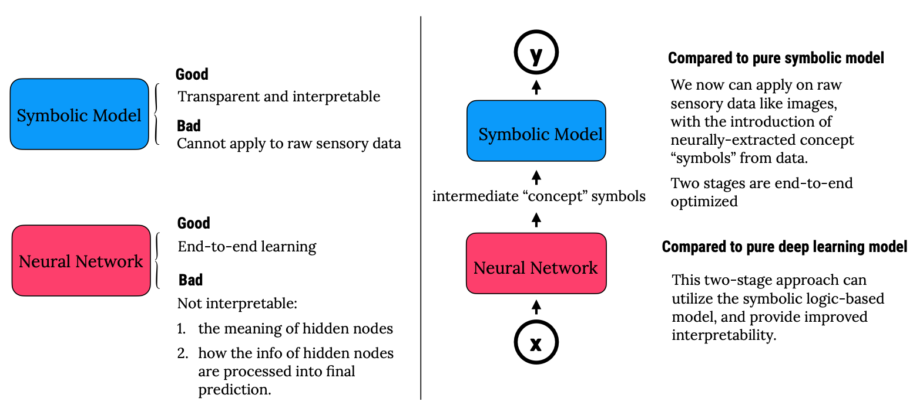

```{r setup, include=FALSE}
library(tufte)
# invalidate cache when the tufte version changes
knitr::opts_chunk$set(tidy = FALSE, cache.extra = packageVersion('tufte'))
options(htmltools.dir.version = FALSE)
```

## A two-stage formulation that integrates “vertically”

<div class="columns-2">
  <div>
  <center>
  
  <center/>
    
  </div>

  <div>
  **Stage 1: the deep neural network**
  <br>
  handles perception: extracting high-level concepts “symbols” from raw sensory data.
  <br>
  <br>
  **Stage 2: the symbolic model**
  <br>
  handles reasoning: utilizes symbolic models to reason about the high-level concepts to make interpretable predictions. The choice of symbolic model to use depends on the task.
  </div>
</div>

## Hybrid v.s. pure symbolic/deep model

<div class="centered">

</div>

## Neural DNF

<div class="centered">

</div>


## Approach: two optimizers

<div class="centered">

</div>

- **Step 1**: Make the model end-to-end differentiable
- **Step 2**: Use two optimizers for the continuous and discrete parameters. Use a SGD optimizer for the first stage neural network, develop a new optimizer for the discrete parameters of the symbolic part. 

## Example: MNIST-sums-to-odd

<div class="centered">

</div>

**How would a human solve this problem?**

Two digit sum up to odd if one of the two digits is an even number and the other is an odd number,
and otherwise it will sum to an even number.

## Applying Neural DNF

<div class="centered">

</div>

## Example 2: bird classification

<div class="centered">

</div>