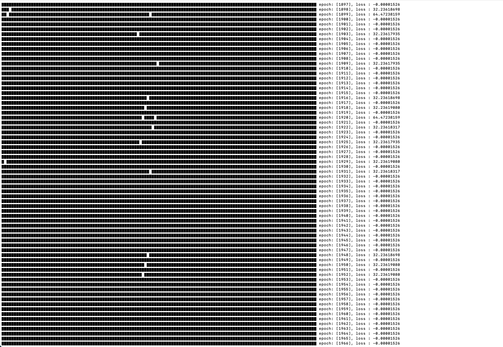
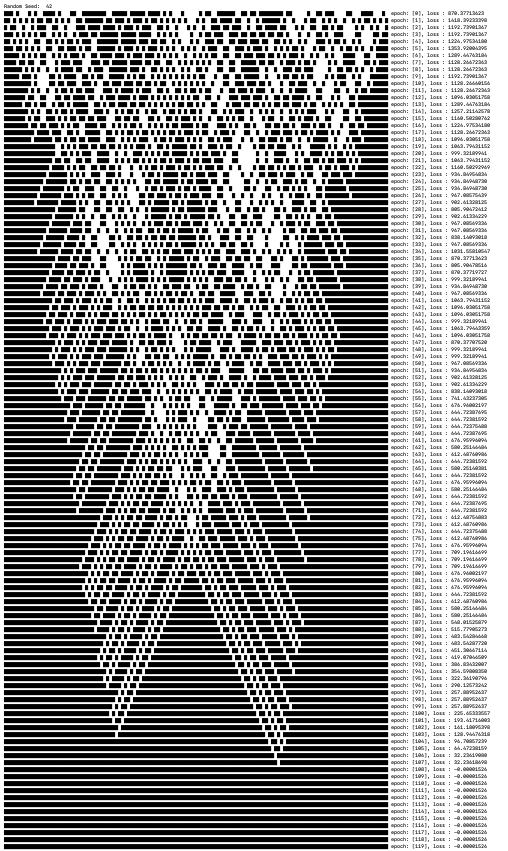

```{r setup, include=FALSE}
library(tufte)
# invalidate cache when the tufte version changes
knitr::opts_chunk$set(tidy = FALSE, cache.extra = packageVersion('tufte'))
options(htmltools.dir.version = FALSE)
```

 [luxxxlucy.github.io](https://luxxxlucy.github.io/)


This post is about tackling the *TerpreT* problem (well, in particular, the the parity chain problem) and offers a simple solution.
In short the TerpreT problem refers to experimental observations that using gradient for program synthesis/induction is not effective and even fails almost constantly in cases which are considered quite simple for more traditional solvers.
This is also summaized in [Daniel Selsam's blog](https://dselsam.github.io/the-terpret-problem/)^[The "Terpret Problem" and the limits of SGD, https://dselsam.github.io/the-terpret-problem/] as the limitations of SGD.
I will explain the context more in the main text but what I do is that I test several alternative methods for learning TerpreT with gradient, and find that one method in particular, the Binary Optimizer (Bop, Helwegen et al. 2019), seems to work quite well. The code for experiment can be found in github^[ [the_terpret_problem_pytorch](https://github.com/LuxxxLucy/the_terpret_problem_pytorch) reposity on github].

I believe the working of TerpreT problem should also point out that learning programs by gradient is still not a bad idea, not only because it will allow integration of differentiable programs with other differentiable neural network components, but also that learning by gradient can leverage massive computation power and thus might be ultimately the most effective by following the [Bitter Lesson](http://www.incompleteideas.net/IncIdeas/BitterLesson.html)^[Richard S. Sutton. 2019. "The Bitter Lesson" ].

Besides, just as reference for more interested readers, I also wrote a recent post on learning discretely-parameterized blocks in deep learning^[On more interesting blocks with discrete parameters in deep learning, https://luxxxlucy.github.io/projects/2020_discrete/discrete.html].

# Introduction

In this section I will explain what *TerpreT* is and what is wrong with it.
Readers can also refer to [Daniel Selsam's blog](https://dselsam.github.io/the-terpret-problem/) for a more accessible version because I will talk about only very briefly. People who are well aware of this problem can skip to next section.

TerpreT @Gaunt:2016:terpret is a probabilistic programming language for inductive program synthesis. The task is to obtain the right program given the input-output pairs. More specifically, the distinguishing feature of TerpreT is that it separates the problem setting with the actual learning algorithm, so synthesis problem with the same setting can be applied with different learning algorithms, such as gradient descent, linear program relaxations, discrete satisfiability solving and the *SKETCH* program synthesis system.

However, the surprising finding is that learning TerpreT by gradient descent does not perform well empirically, and that the authors of the TerpreT paper even constructed a minimal example of a synthesis problem (the Parity Chain problem) that exhibits an exponential number of inadequate local optima, for which leaning by gradient consistently gets stuck, 'even when applying every trick in the book'.

The parity chain problem starts with a circular chain of $k$ boolean variables. Out of the $k$ variables, one of the Boolean variable is a fixed input $x_0$, while the rest $k-1$ variables are learnable parameters.

    def parity_problem(x_0):
        '''
        k : the length of the circular Chain
        x_0 : Boolean input
        xs : parameters array, Boolean, size k-1
        ys : array, Boolean, size
        '''
        xs = [x_0] concanate with xs
        ys = [ XOR(xs[i], xs[i+1 % k]) for i in range(k) ]
        return ys

The methods employed in the paper is to represent each boolean variable by a Bernoulli distritbution and give a differentiable version of the parity problem. And then we can optimize the the parameter of this Bernoulli distribution simply by gradient descent.  

In this partiy chain problem, if we set the input-output pair as $x_0=0$ and all output equals to $0$, then we know that all the parameters $xs$ must be zero. But surprisingly, learning by gradient does work and fail to discover the all-zero solution. And as mentioned in the paper, adding some heuristics such as noise helps only sightly and all the heuristics does not work for large instance with $k > 128$.

[Daniel Selsam's blog](https://dselsam.github.io/the-terpret-problem/) gives a very detail description on why this happens and I will not cover here.


## Rethinking about alternative methods.

The main reason for advocating such differentiable programming languages is that, the differentiability allows for gradient-based parameter learning. And the result of the parity chain problem should be somewhat pessimistic to see. From my point of view, we can expect gradient-based learning to be slower since it requires iteractive mini-batchs, but it cannot be the case that it fails to learn in very simple problems.

As in the parity chain problem, it fails because some parameters happen to be 50% for zero and 50% for one, and being 50% makes it receive no more gradient as the computed gradient becomes zero. So a natural solution is, let avoid the case of being 50%, meaning each boolean variable must have an asymmetric distribution for being zero and one; if the 50% situation is avoided, then we get rid of the zero-gradient situation, and then we perhaps can learn successfully!

I tried with several alternative methods and I append a short description of experimental observation for each.

* **Gumbel-softmax trick**:  does not work.
* **Straight-through Estimator (STE)**: work, but a little bit unstable.
* **Binary Optimizer (Bop)** : works and very stable, even works for $k=1024$
```{marginfigure}
For Bop, I did not test with larger $k$ but I think for larger $k$, Bop will work as expected, just costing more epoch.
```

## Alternative Methods.

**Gumbel-softmax trick**

The Gumbel-softmax trick or known as the concrete distribution is proposed independently by @Jang:2016:categorical, @Maddison:2016:concrete. Basically it uses an extra temperature parameter that is manually decreased per epoch. When the temperature is small, the distribution will be close to very clean and sharp discrete value; but when the temperature is high, the distribution might be like 50%/50%.

Gumbel-softmax is widely applied in a lot of applications, but unfortunately in the parity chain problem, it fails to work. It seems that the temperature is not really helpling and the same 50%/50% is obtained in the end.

Because of the failuer of Gumbel-softmax, I start to think a more aggressive perspective, like in binary neural networks where the weight only have to values, can we also say that the Boolean variables also have either a 1 or 0.

**Straight-through Estimator (STE)**
Straight-through Estimator (STE) is now the dominant technique for binary neural networks. It was designed for parameters of value $\{-1,1\}$.
Straight-through estimator (STE) is first proposed in Hinton's course lecture, and later more formally analyzed and evaluated by @Bengio:2013:estimating.

STE maintains a continuous parameter, but only threshold into binary values in the forward computation. Note that a thresholed parameter $\hat{w}$ is used for computing the objective function in the forward pass, but in the backward pass, the gradient is updated to $w$. Since what is actually being optimized is still a continuous one, usual continuous optimization methods like SGD/Adam still apply.

In the forward pass, we binaried $w$ into
$$ \hat{w} =
     \begin{cases}
         1, & \text{if  } w > 0.5 \\
         0, & \text{otherwise}.
     \end{cases}
$$
and in the backward pass, the gradient is upated to the continuous parameterer $w$.

In practice, we test STE and find that it does can learn the parity problem successfully. Use the refered github reposity and run "python run.py --type=2 --k=128 --v=128", you can see the STE converges to the right solution in about 2000 epochs.

This is the screenshot taken by runing this command in terminal. Each line represent the states of the parameres, while a full block represents 100% being zero, and a empty block represents 0% being zero.
For $k=128$, STE converges in about 2000 epochs but you can see in the above figure that for epochs before the convergence, some of the parameters seems to accasionally flip its value of zero and one. This is just the way STE is. It does not have a mechanism like Bop which will be introduced below, to prevent the nosiy flips of zero-one values, so it might be a little bit not so stable compared to Bop.

**Binary Optimizer (Bop)**
The Binary Optimizer (Bop) by @Helwegen:2019:rethinking provides a new perspective on learning binary parameters. So far, all the methods we introduced maintains a latent continuous parameter and thus optimization is straight forward. Standard optimization methods like SGD or Adam can be employed with no difficulty. One might ask, can we start making a new optimizer that directly optimize discrete valued parameters?
The answer is yes and that is Binary Optimizer (Bop).

```{marginfigure}
The Bop is originally developed for binary neural network with parameter value in $\{-1,1\}$. To be consistent, we will suit into the case of $\{0,1\}$
```
Bop uses gradient as the learning signal and flips the value of $w \in \{0,1\}$ only if the gradient signal $m$ exceeds a predefined **accepting threshold** $\tau$:
$$
w =
\begin{cases}
   1-w , & \text{if } |m| > \tau \text{ and } ( w=1 \text{ and } m>0 \text{ or } w= 0 \text{ and } m<0  )  \\
   w, & \text{otherwise}.
\end{cases}
$$
where $m$ is the gradient-based learning signal computed in the backward pass.

A non-zero $\tau$ is introduced to avoid rapid back-and-forth flips of the binary parameter and we find it helpful to stabilize the learning because $m$ is of high variance.
To obtain consistent learning signals, instead of using vanilla gradient $\nabla$ as $m$, the exponential moving average of gradients is used
$$
m = \gamma m + (1-\gamma) \nabla
$$
where $\gamma$ is the exponential decay rate and $\nabla$ is the gradient computed for a mini-batch.

In the parity problem, we set  $\gamma=1-10^{-5}$ and $\tau=10^{-1}$. A smaller $\tau$ will takes longer to converge to the right solution. It should also be mentioned that the accepting threshold $\tau$ is the main advantage of Bop over STE, because a non-zero $\tau$ helps avoid rapid back-and-forth update by noisy gradient, and is thus more stable.

Use the refered github reposity and run "python run.py --type=3 --k=128 --v=128", you can see the Bop converges to the right solution in about 100 epochs. For $k=1024$, Bop converge to the right solution in about 900 epoch.



For $k=128$, Bop can recover the solution in about 100 epoch. This is the screenshot taken by runing this command in terminal. Each line represent the states of the parameres, while a full block represents 100% being zero, and a empty block represents 0% being zero.

One thing to mention, with a smaller accepting threshold, Bop can takes longer to converge; as in the extreme case, if we set the accepting threshold to zero, then Bop will be somewhat very like STE.
But of course, when introduce a new hyperparameter (the accepting threshold), we will need to spend extra efforts to tune it.

# More sophisticated functions than parity chain.
There are, a slight variation of STE/Bop called STE/Bop with adaptive noise, which is designed to a more sophisticated case (the Neural Disjunctive Normal Form) where gradient can be zero even if all parameters are 1 or 0. You can see [my other blog](https://luxxxlucy.github.io/projects/2020_discrete/discrete.html) for more information, but in short, the parity chain problem of TerpreT happens because gradient becomes zero when we have a 50%/50% situation for some certain parameters. So avoid the 50%/50% situation and use directly 1- or 0-valued parameters can solve this problem; but STE/Bop with adaptive noise is introduced for even more complex function than the parity chain. So we do not need the new version 'STE/Bop with adaptive noise', since STE/Bop is already working very well.
But anyway, STE/Bop with adaptive noise is proposed for the Neural Disjunctive Normal Form^[Lu, Jialin, and Martin Ester. 2020. “Neural Disjunctive Normal Form: An Inherently Interpretable Deep Learning Classifier.” *Manuscript under Review*. We do not have a preprint version but you can download [PDF here](../2020_discrete/neural_dnf.pdf)] model which can learn IF-THEN rules for classifications and learned by gradients, this is novel as most of traditional methods for rule learning are combinatorial discrete optimization algorithms and we can also integrate other neural network with the IF-THEN rules.

# Last words

1. Solving parity chain is not the end for all the problems of TerpreT. But at least it shuold be a start.

2. Using STE/Bop, we might be able to re-benchmark the empirical results in the original TerpreT paper.
