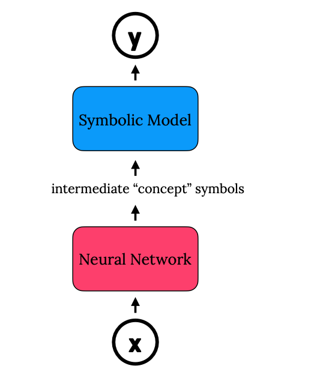

```{r setup, include=FALSE}
library(tufte)
# invalidate cache when the tufte version changes
knitr::opts_chunk$set(tidy = FALSE, cache.extra = packageVersion('tufte'))
options(htmltools.dir.version = FALSE)
```

## flexible design of model
<div class="columns-2">



Neural DNF is not quite flexible!

- In Neural DNF, we integrate a disjunctive normal form with a network. But there are many other forms of model.
  - We should extend from just propositional logic to a wider range of models, such as  MaxSAT ([SATNet](https://arxiv.org/abs/1905.12149)) or [planning](https://arxiv.org/abs/2009.07476) or general algorithms ( [Veličković, et al](https://arxiv.org/abs/2105.02761)) and combinatorial solvers ([Vlastelica, et al](https://arxiv.org/abs/1912.02175)).
- The Neural DNF is a two-stage *vertical* integration, can we be more free?
- more generally, can we do this at the same time?
</div>

## Simple! Design a language!

Design a (domain-specific) language where you can

- flexibly define a model specification. 
- do not worry about developing a bespoke customized algorithm for a particular model. 
  - But rather separate the inference/optimization from model definition. Use a **general-purpose** optimization procedure!
<br><br><br>
- One example can be seen as by PyTorch etc for deep learning.
  - you define some customized model (in the langauge of deep learning blocks).
  - leave everything to a general purpose inference engine (Autodiff and SGD)

## Possible approaches

* The domain-specific language can vary depending on the task.

* But usually such model should contain both continuous and discrete variables. So we can look at the inference/optimization engine first.

* I think there are many ways to do it:
  - backprop and gradient-based optimization
    - backprop and SGD works well for continuous models, so in this approach we should focus on make gradient-based optimization work on discrete parameters.
    - initial results:
      - [Solving the TerpreT Parity chain problem](https://luxxxlucy.github.io/projects/2020_terpret/terpret.html), which is a quite difficult task for gradient-based optimization. 
      - Ongoing project [Mitigating The Failures Of Gradient-Based Program Induction](https://luxxxlucy.github.io/projects/2021_terpret/index.html)
  - probabilistic programming: blackbox variational inference, MCMC, etc
  - reduce to SAT, MaxSAT 
  - reduce to general optimization solvers, mixed integer programming, ...

## To summarize

This approach of (1) designing a domain-specific modelling language for a class of models, and (2) use a general purpose inference/optimization engine is from my opinion a very important direction. Because it is aligned with the [bitter lesson](http://www.incompleteideas.net/IncIdeas/BitterLesson.html)

- There are many good exampels or demonstration.
  - a lot of industrial level verification problem can be encoded and solved by SAT sovlers.
  - a lof of industrial inference task can be solved by probilisitic programming softwares, STAN, Infer.Net, etc.
  - a lot of **___________** should be able to be solved by optimization solvers. We just need a good interface of language, a good translation compilation, and a good general purpose optimization solver.
  
- And that is why I am applying for the job on optimization solver at Huawei.

