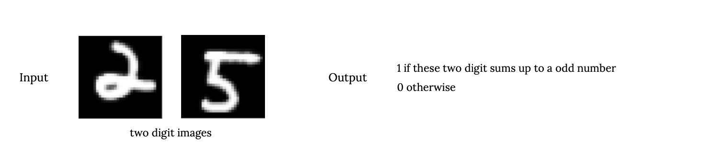
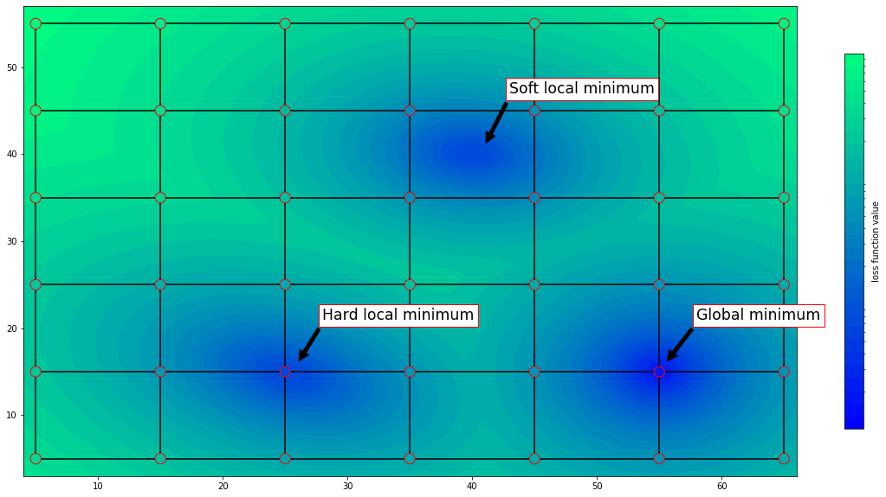
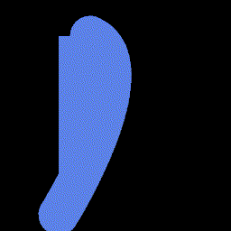

```{r setup, include=FALSE}
library(tufte)
# invalidate cache when the tufte version changes
knitr::opts_chunk$set(tidy = FALSE, cache.extra = packageVersion('tufte'))
options(htmltools.dir.version = FALSE)
```

<style>
div.footnotes {
  position: absolute;
  bottom: 0;
  margin-bottom: 10px;
  width: 80%;
  font-size: 0.6em;
}
</style>

<script src="https://ajax.googleapis.com/ajax/libs/jquery/3.1.1/jquery.min.js"></script>

<script>
  $(document).ready(function() {
    $('slide:not(.backdrop):not(.title-slide)').append('<div class=\"footnotes\">');

    $('footnote').each(function(index) {
      var text  = $(this).html();
      var fnNum = (index+1).toString().sup();
      $(this).html(text + fnNum);

      var footnote   = fnNum + ': ' + $(this).attr('content') + '<br/>';
      var oldContent = $(this).parents('slide').children('div.footnotes').html();
      var newContent = oldContent + footnote;
      $(this).parents('slide').children('div.footnotes').html(newContent);
    });
  });
</script>

## Background 

(before I think programs and discrete parameters are important)

When I was taking my undergraudate in Zhejiang University, I was working on [unsupervised disentanglement learning](https://luxxxlucy.github.io/projects/2019_disentangle/index.html). I think it is such a fundamentally important topic but I underestimate its difficulty. Not long after there was a google paper proves and empirically shows that unsupervised disentanglement is not possible.

I then came to Vancouver to study with Martin Ester. The first year I was working on interpretability, made some projects and papers. 

## Why I start to think programs and discrete parameters are important

- But after I did something and get familiar with ML interpretability, I became to doubt what is truly interpretable after all.

- After some long peirod of reading and thinking, I reached my conclusion

- **Code written by a programmer is interpretable to the programmer, as well as the colleague and other people if they can be taught to read and analyse the code**
  - And it is not just interpretable, but also generalize well and managebale, maintainable. This should be the ultimate form of ML, turning it more like normal software development.
  
- letting machine to code, or program synthesis is a old and well-studied task. But I am interested in more non-conventional programs.
  - for example, hybrid network-program models

- Unfortunately this brings many new challenges, such as designing a general purpose learning algorithm. The basic question is that it will involve binary and categorical parameters to infer.

## My first try on program-network hybrid models.

<div class="columns-2">


I start with a basic two-stage model for such hybrid model.

- the purpose is that with the neural network, we can leverage a symbolic program to work on sensory data like images.
- I start with by defining the symbolic program to be of propositional logic, and design a learning algorithm to learn end-to-end.
</div>


## Neural Disjunctive normal form

An example task:
<div class="centered" style="margin-top:-140px">

</div>

- **How would a human solve this problem?**
- perhaps a two stage computation.
  - determine for each of the two digits, whether it is odd or even.
  - make decision: two digit sum up to odd if one of the two digits is an even number and the other is an odd number, and otherwise it will sum to an even number.
  
- **Result of my learning algorithm**
  - the first stage network actually produces an output that corresponds to being even/odd with over 99% accuracy. (this is good as we do not use any direct label)
  - the learned rules (in propositional logic) matches exactly like human intuition.

## General purpose learning algorithm

The one I used in Neural DNF is a two optimizer approach. 
- One optimizer for the continuous parameters
- another for discrete parameters. 
- Each take gradient and update parameter in a mini-batch setting

- simple design, no theoretical soundness, just try to be like normal deep learning. Hoping this can be ultimately the most efficient way of learning (the bitter lesson)

## But this end-to-end gradient-based algorithm is not good as expected

- problems 1: **symbolic grounding**
- problems 2: the general-purpose algorithm, which leads me to look at TerpreT.

## TerpreT.

the usual parity chain, FMGD.

## Soft local minima
<div class="centered" style="margin-top:-140px">

</div>

- a method different than FMGD would be to use discrete parameters, accompanied with a new update rule for the discrete parameters.
  - it avoids the soft local minima.
  - but of course have porblems. (not so optimization friendly)

## Discrete parameters
<div style="margin-top:-140px">
I wrote a blog on [optimizing interesting discrete blocks](https://luxxxlucy.github.io/projects/2020_discrete/discrete.html).

- straight-through estimator and binary optimizer
$$
w =
\begin{cases}
   1-w , & \text{if } |m| > \tau \text{ and } ( w=1 \text{ and } m>0 \text{ or } w= 0 \text{ and } m<0  )  \\
   w, & \text{otherwise}.
\end{cases}
$$
$w$ is either $0$ or $1$. $m$ represents the gradient, and $\tau >= 0$ is a hyperparameter, a threshold.
- straight through estimator is $\tau=0$.

- we can also write Bop/STE as follows
$$
w =
\begin{cases}
   1-w , & \text{if } (2w-1) m > \tau  \\
   w, & \text{otherwise}.
\end{cases}
$$
- STE/Bop in this way only works for binary parameter. But we can see this condition is actually a taylor series approximation. $$L_{w fliped}-L_{w} \approx (2w-1)m$$
- so we can actually genealize to categorical parameter.
</div>

## New algorithm

- finding a threshold is painful. so I get rid of it.
- previously every bit can be flipped if exceeds a threshold.
- now we only flip one bit, which has the maximal value.

## Running average -> parity chain

It seems it resembles unit propagation.

<div class="centered" style="margin-top:0px">

</div>

## A simple graphics program
<div class="columns-2">
```
def a_drawing_program():
    int K;
    if K == 0:
        draw_a_circle(x_0,y_0,radius,color_0)
    else if K == 1:
        draw_a_rect(x_1,y_1,width,height,color_1)
    else if K == 2:
        draw_a_close_curve(points,color)
    return the_output_drawing
```
<br>

<p align="center" width="100%">
        
        
</p>
<p align="center" width="100%">
    <b>Left</b>: target image. <b>Right</b>: the optimization process
</p>
</div>

## Results on some TerpreT circuits tasks

Tons of problems. And perhaps gradient-based end-to-end learning is not so good after all.

<div class="centered" style="margin-top:0px">

</div>

## Last

My supervisor Martin Ester is an expert on data mining. I spent sometime to convince him to let me work on hybrid programs (neuro-symbolic). But to now I think I am having a difficult time, as I am mostly doing the research on my own.

* **possible directions forward**
* further study on the unit propagation like behaviour with running average (momentum)

* the end-to-end gradient based optimization is not the only machine learning approach! 

* regarding the design of domain-specific language and how to integrate programs with networks. There are other ways.

* better investigation of the symbolic grounding problem.

