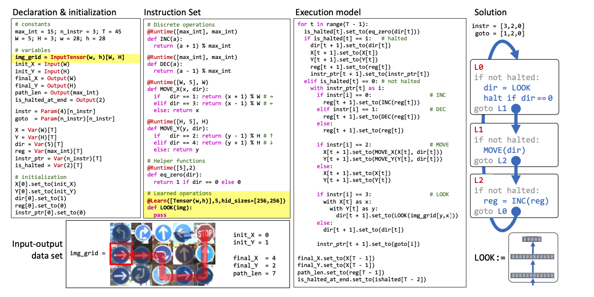

```{r setup, include=FALSE}
library(tufte)
# invalidate cache when the tufte version changes
knitr::opts_chunk$set(tidy = FALSE, cache.extra = packageVersion('tufte'))
options(htmltools.dir.version = FALSE)
```

Jialin Lu [luxxxlucy.github.io](https://luxxxlucy.github.io/)

`r sans_serif(
" This is an on-going project. And symbolic grounding in general is a very hard problem, perhaps even so in a philosophical sense.
")
`


<script>
  // Move TOC to the Table of Contents heading (with id "table-of-contents")
  $(function() {
    $( "#TOC" ).insertAfter( $( "#table-of-contents" ) );
  });
</script>

# Definition

Free assembly of customized blocks is part of the fun of deep learning, if not all the essence of it. We study the two-stage computation as follows:
$$ x \mathop{\longrightarrow}_{h} z \mathop{\longrightarrow}_{g} y $$
where $h: X \mapsto Z $ and $g: Z \mapsto Y $ are two different computation blocks which are applied to the input $x$ sequentially. so $\hat{y} = f(x) = g(h(x)) $. $z = h(x)$ here can be understood as an intermediate label.

The key question of end-to-end symbolic grounding problem can thus be stated as follows:

Given a ground-truth dataset $(X,Z,Y)$ representing the input, the intermediate label and the final label, suppose in training the intermediate label $Z$ is absent, and we are only using $(X,Y)$ to minimize $\sum_{x,y} L\left(g(h(x)) - y\right) $, can we obtain the intermediate label $z$?

This tasks can be traced to the 

The task is that 

Neuro-symbolic grounding, in particular, the vertical integration.

system 1 and system 2

Usually, $g$ and $h$ may be computation blocks of very different nature, embedded with drastically different inductive bias.

Recent research has seen various ways of making the second stage block $g$, a conventionally non-differentiable computation block, differentiable and then trains the model end-to-end. 
SATNet.

However, despite the wishful thinking, this is not successful.


The importance of end-to-end symbolic grounding thus cannot be underestimated.

::: {.fullwidth}

:::
