```{r setup, include=FALSE}
library(tufte)
# invalidate cache when the tufte version changes
knitr::opts_chunk$set(tidy = FALSE, cache.extra = packageVersion('tufte'))
options(htmltools.dir.version = FALSE)
```


```{=html}
<script>
  // Move TOC to the Table of Contents heading (with id "table-of-contents")
  $(function() {
    $( "#TOC" ).insertAfter( $( "#table-of-contents" ) );
  });
</script>
```

```{marginfigure}
Github repo [LuxxxLucy/ids_embedding](https://github.com/LuxxxLucy/ids_embedding)
```

`r sans_serif("Here, we discuss an embedding for the Ideographic Description Sequence (IDS)")`
```{marginfigure}
Say, [Explosive Ordnance Disposal' aka EOD or 拆字小组](https://github.com/3type/EOD)
```
, which can be used to retrieve CJK (China-Japan-Korea) ideographic glyphs. This embedding offers several advantages over rigid approaches, such as tedious structure comparison or edit distances.

-   Quick & scalable
-   Considerably more flexible/sense-making
or those based on edit distances.

`r newthought("Here's a quick preview of example applications:")` 
Suppose you have the character "亨" (with IDS "⿱亠⿱口了"). Based on the embedding, we can find similar characters:

> **_INPUT:_**  ⿱亠⿱口了
> 
> **_RETRIEVED:_**(top-10)  亨 烹 呟 玄 競 咬 員 捨 喨 罟

We can also apply this approach to an arbitrarily created glyph "⿱⿰耳口之," which substitutes one radical from "聖" ("⿱⿰耳口王"). In this case, we can find:


> **_INPUT:_**  ⿱⿰耳口之
> 
> **_RETRIEVED:_**(top-10) 聖 緊 咒 恕 笘 坪 譖 絮 彈 娶


I cannot anticipate whether it could be useful for the designers (I guess a demo will not), but it should do no harm to anyone. I am hoping this asset can do some help in the intricacies of typographic design endeavors.

## Background and Formulation

Background and Formulation
The Ideographic Description Sequence (IDS) provides a compositional description of CJK ideographs. 
For example, the character '楫' can be described using an ideographic description string as '⿰木⿱口耳'. 
In this IDS, '⿰⿱' are known as ideographic description characters (IDC).

```{marginfigure}
Note the difference of IDS (Sequence) and IDC (Character)  The whole set of ideographic description character (IDC) are ⿰	⿱	⿲	⿳	⿴	⿵	⿶	⿷	⿸	⿹	⿺	⿻.
```

The IDCs ('⿰⿱') are specifically designed to express compositional relationships, while '木口耳' are ideographs themselves, often referred to as components or radicals, which are assembled to form a new character, such as '楫'.

We can provide a more formal specification of IDS. As I am using ANTLR to generate the parsing code, let's focus on the main idea of the context-free grammar for IDS in the **G4** format (ANTLR 4):

```
// Define a grammar called ids
grammar ids;
glyph : 'Glyph' ID ideographic;
ideographic : 
    Part # CJKPART
    | Unknown # Unknown
    | op=IdsBinaryOperator op1=ideographic op2=ideographic # CJKBinaryComposition
    | op=IdsTrinaryOperator op1=ideographic op2=ideographic op3=ideographic #CJKTrinaryComposition
    ;

IdsBinaryOperator : '\u2FF0' | '\u2FF1' | '\u2FF4' | '\u2FF5' | '\u2FF6' | '\u2FF7' | '\u2FF8' | '\u2FF9' | '\u2FFA' | '\u2FFB' ; // : [⿰⿱⿴⿵⿶⿷⿸⿹⿺⿻]
IdsTrinaryOperator : '\u2FF2' | '\u2FF3' ;   // [⿲⿳]
 
// lexical rules
Part : ('\u4E00'..'\u9FFF' |'\u3400'..'\u4DBF' |'\u{20000}'..'\u{2A6DF}' |'\u{2A700}'..'\u{2B73F}' |'\u{2B740}'..'\u{2B81F}' |'\u{2B820}'..'\u{2CEAF}' |'\u{30000}'..'\u{3134F}' |'\uF900'..'\uFAFF' |'\u{2F800}'..'\u{2FA1F}' |'?') ;
```

## Embedding: Why&How

We are interested in finding an embedding for the IDS on which we could observe nice distance metrics in a Euclidean space where computation on vectors is cheaply available..

Now a quick/naive idea would be simply treating the IDS as a sequence and invoke a neural model for sequences.
This approach exposes the following drawbacks:

1.  While IDS itself is in its plain form a flat sentence, it is in fact **NOT** a flat sequence, because it represents a tree that is composed by sub-parts

    ```{marginfigure}
    Sibling/children nodes in a IDS tree have relative relationships; these nodes are ordered and not commutative. Meaning ⿱口耳 and ⿱耳口 are different. For a particular IDC such as ⿱, its first child is specified as in the top, and the second in the bottom, *by definition*.
    ```
    
2. Not leveraging compositional structure is not itself necessarily a bad idea, 
    ```{marginfigure}
    Unfortunately I believe for such a simple task, invoking a large model is just introducing excessive burden of unnessary carbon footprints to our mother earth.
    ```
but generalizing to long sequence to certain extent is difficult. Or at least not easy if we only wish to afford a lightweight model.

While the rationale should now be clear, let us state explicitly:

> A sequence model for the task we are considering is sub-optimal; we would like a model that operates on trees; not just any tree, but trees that has ordered children/sibling nodes.

So here I propose to use of tweaked version of the Tree LSTM to learn embeddings for IDS.
 But before that, let us first look at a normal sequence,

```{r echo=FALSE, fig.cap = "Figure 1: A example sequence", dev='png'}
DiagrammeR::grViz("
  digraph graph2 {
  
  graph [layout = dot, rankdir = LR]
  
  # node definitions with substituted label text
  node [shape = oval]
  a [label = 'a']
  b [label = 'b']
  c [label = 'c']
  
  a -> b -> c
  }
  ",
  height = 100)
```

Let us now denote a recurrent unit function $f$ which is parameterized by a neural network (RNN or LSTM cell), and further denote $E$ the embedding function that converts a token into a token embedding, implemented as a look-up table.
The function $f$ takes hidden states and input and outputs a new state $H$. For node `a`,$$
H(a) = f(\text{hidden_state}=E(\text{START}), \text{input}=E(a))
$$

Because `a` is the first token in the sequence, we need to introduce an extra token `START`.
And then for token `b`, the process continues by using $H(a)$ as the hidden_state.

$$
H(b) = f(\text{hidden_state}=H(a), \text{input}=E(b))
$$

and then

$$
H(c) = f(\text{hidden_state}=H(b), \text{input}=E(c))
$$

By this point, $H(c)$ is the embedding of the sequence.

Now let us move to a tree and explain what the Child-sum Tree LSTM [@tai:2015:improved] works.
Here let us assume that while `a` and `b` are both the children of `c`, there is an order that `a` precedates `b`.

```{r echo=FALSE, fig.cap = "Figure 1: A example tree", dev='png'}
DiagrammeR::grViz("
  digraph graph2 {
  
  graph [layout = dot, rankdir = LR]
  
  # node definitions with substituted label text
  node [shape = oval]
  a [label = 'a']
  b [label = 'b']
  c [label = 'c']
  d [label = 'd']
  
  a -> c -> d
  
  b -> c
  }
  ",
  height = 100)
```

The hidden state of `a` and `b` are straightforward: $$ H(a) = f(\text{hidden_state}=E(\text{START}), \text{input}=E(a)) $$ and $$ H(b) = f(\text{hidden_state}=E(\text{START}), \text{input}=E(b)) $$, the tricky part is how we aggregate the children node for the parent.
The child-sum Tree LSTM, as the name suggests, aggregates the hiddent states of children nodes by summing it up, so $$
H(c) = f(\text{hidden_state}=H(a) + H(b), \text{input}=E(c))
$$

Readers may already notice now that the sum operation considers no information regarding the order of the children nodes.
One may come up with some ideas ressembling familiar works, such as adding some position encodings or adding a weight to the children nodes.

```{marginfigure}
$H(c) = f(\text{hidden_state}=W_1 * H(a) + W_2 * H(b), \text{input}=E(c))$. This is also the follow up called N-ary Tree LSTM from the paper.
```

Here in my tweak, let us just use another network to process the children nodes as a sequence.

We can think of the original Child-sum Tree LSTM performing a sequence processing from left to right (from leaves to root) and uses sums for children/sibling nodes (from top to bottom), while in our case, we retain the left-ro-right recurrent model and add another recurrent model to process the children/sibling nodes from top to bottom.
Denote the new recurrent function as $g$, we have: $$
H_g(a) = g(\text{hidden_state}=E(\text{START}), \text{input}=H(a))
$$ $$
H_g(b) = g(\text{hidden_state}=H_g(a), \text{input}=H(b))
$$ and finally we arrive at $$
H_f(c) = f(\text{hidden_state}=H_g(b), \text{input}=E(c))
$$

```{marginfigure}
Rigid methods like manual structure comparison (simply retrieving glyphs sharing the same left-part) or tree editing distances may sound appealing, but they require tedious parameter tuning and often yield limited results. This approach has its drawbacks.
```

I will refer to this model as Cross Tree LSTM. The term "cross" signifies that the old child-sum Tree LSTM focuses only on the horizontal direction, disregarding the order of children nodes. In our approach, we introduce an additional LSTM to handle the vertical direction. Thus, we have two LSTMs—one for the vertical direction and one for the horizontal direction—making it a 'cross'.

# Other Aspects: Preparation, Model, Training

The previous discussion focused on obtaining the embedding, which pertains to the encoder architecture. The decoder part, on the other hand, is relatively straightforward as I don't see any significant differences. We can use another RNN for decoding, aiming to recover the IDS as a sequence rather than a tree. 

```{marginfigure}
A simple decoding-into-sequence approach with smooth gradient backpropagation is sufficient.
```

The IDS dataset comes form the KanjiVG database, which is not a complete archive of every CJK ideographs, but is good enough to validate the demo. An entry would be something like 

> 【盃】⿱不皿

The character bounded in "【】" is the character of interest, following by a space and then the IDS description. In our code, we use `ANTLR` to generate the parsing code. A complete specification of the G4 format grammar definition is as follows:

```
// Define a grammar called ids
grammar ids;
glyph : 'Glyph' ID ideographic;
ideographic : 
    Part # CJKPART
    | Unknown # Unknown
    | ('<' indicator=Part '>' String* )?  op=IdsBinaryOperator op1=ideographic op2=ideographic # CJKBinaryComposition
    | op=IdsTrinaryOperator op1=ideographic op2=ideographic op3=ideographic #CJKTrinaryComposition
    ;

IdsBinaryOperator : '\u2FF0' | '\u2FF1' | '\u2FF4' | '\u2FF5' | '\u2FF6' | '\u2FF7' | '\u2FF8' | '\u2FF9' | '\u2FFA' | '\u2FFB' ; // : [⿰⿱⿴⿵⿶⿷⿸⿹⿺⿻]
IdsTrinaryOperator : '\u2FF2' | '\u2FF3' ;   // [⿲⿳]
 
// lexical rules
Part : ('\u4E00'..'\u9FFF' |'\u3400'..'\u4DBF' |'\u{20000}'..'\u{2A6DF}' |'\u{2A700}'..'\u{2B73F}' |'\u{2B740}'..'\u{2B81F}' |'\u{2B820}'..'\u{2CEAF}' |'\u{30000}'..'\u{3134F}' |'\uF900'..'\uFAFF' |'\u{2F800}'..'\u{2FA1F}' |'?') ;

Indicator : '\u4E00'..'\u9FFF' ;
Unknown: '?';
ID : ([a-z]|[A-Z]|[0-9])+ ;             // match lower-case identifiers
String : '('('a'..'z'|'A'..'Z'|' ')+')' ;             // match lower-case identifiers
WS : [ \t\r\n]+ -> skip ; // skip spaces, tabs, newlines
```
Implementation notes: 

1. The Basis of the code about the tree embeddings comes from the benchmark code [here](https://github.com/JetBrains-Research/embeddings-for-trees). The main framework (train/encode/decode routines) is reused. We will use the aggregated embedding for the whole tree when we compute the distance computation and retrieval.
2. The backend is based on [dgl](https://github.com/dmlc/dgl) and pytorch. `dgl` in my opinion is the essential life-saver here. It uses a graph batch data structure to parallellize the computation on the graphs which would otherwise be quite tricky to handle. Although at first sight the APIs seems opaque to understand, one would not regret to migrate existing code to the `dgl` framework.

# Future Work and Potential Improvements

Now that we have presented the embedding for an IDS tree, it is important to acknowledge that this may not be a critical concern. Another aspect worth considering is the retrieval of components that appear in similar contexts, rather than finding similar characters solely based on IDS. Components can manifest in different spatial arrangements, but identifying components in the same context could yield more valuable results. For instance, if we have the component "口" in the character "扣," the occurrence of "口" in "知" is undeniably more relevant than its occurrence in "吃." This task holds potential significance.


