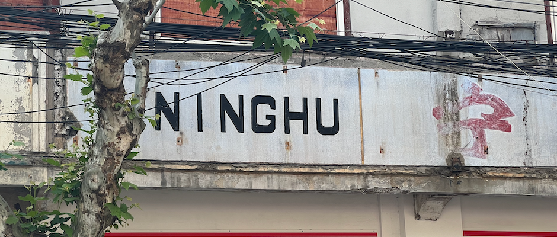
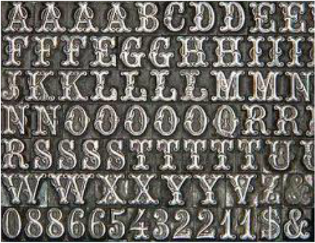
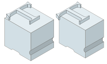
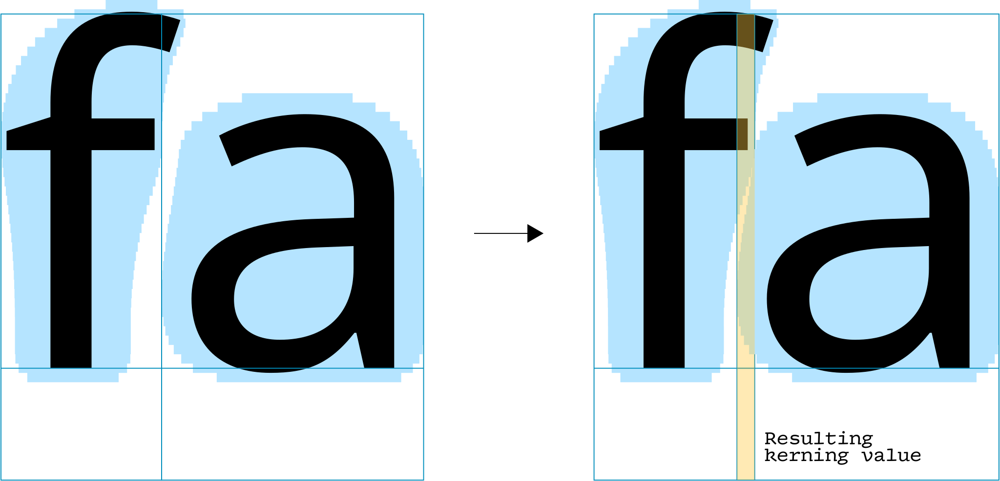
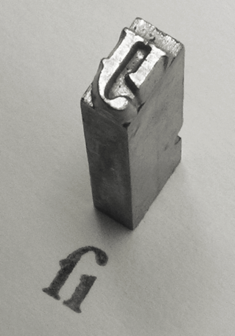
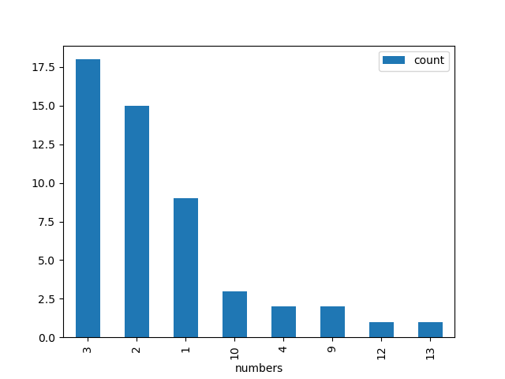
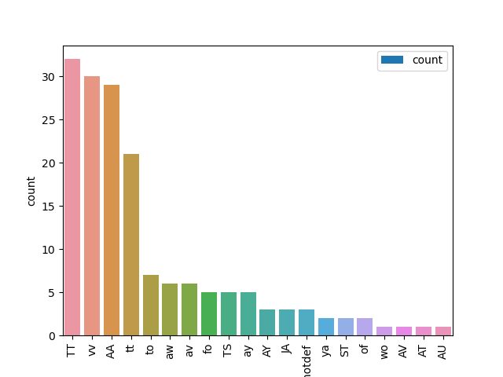

```{r setup, include=FALSE}
library(tufte)
# invalidate cache when the tufte version changes
knitr::opts_chunk$set(tidy = FALSE, cache.extra = packageVersion('tufte'))
options(htmltools.dir.version = FALSE)
```

```{=html}
<script>
  // Move TOC to the Table of Contents heading (with id "table-of-contents")
  $(function() {
    $( "#TOC" ).insertAfter( $( "#table-of-contents" ) );
  });
</script>
```

Source code is available at [bubblekern-demo](https://github.com/LuxxxLucy/bubblekern-demo).
Please feel free to contact me by email.

This post is about examining the use of BubbleKern^[BubbleKern: Kerning with Bézier curve, *Toshi Omagari*, ATypI 2016 Warsaw, Poland
[Blog](https://tosche.net/blog/bubblekern)
[Code](https://github.com/Tosche/BubbleKern)
[Tutorial](https://www.youtube.com/watch?v=TA2RZQivvS0)],
an automatic kerning tool based on the idea of collision detection.
The fundamental question I intended to explore is whether BubbleKern provides the same flexibility compared to an explicit kerning table.

In simpler terms,

>  Is there a kerning table which BubbleKern can't reproduce, regardless of how we outline the "bubbles"?

This hypothesis arose from my hands-on experience on BubbleKern where I struggle to accurately recreate Helvetica's kerning particularly for the `ff` pair. 
However I draw the bubble, it seems to contradict with other letter pair combinations.

Luckily we can verify this hypothesis, using modern
SMT (satisfiability modulo theories) solvers to enumerate over every possible bubble outline and comparing them against the kerning table of a font.
And the result is that BubbleKern is unable to reproduce even a small set of letter pairs of an existing font, which confirms my suspicion.

Toshi Omagari, BubbleKern's creator, mentioned that he can use it to accomplish around 80%~90% of the job and leave the rest to manual fine-tuning.
And here I am arguing for a slightly different but relevant statement, that it is really a bad idea to relying 100% on BubbleKern. 
Later in this post I will also provide a small set of letter pairs that the BubbleKern cannot reproduce across multiple fonts, so that we might pay additional attention to, which might be useful.

Anyway, the key message here is that you shouldn't over-rely on machine/software no matter fancy it sounds.
A considerable portion of kerning tasks should be undertaken manually, a concept that I guess should resonates with seasoned designers^[ Nice ... "As it should be!" ...  --- Chernyshevsky would be very proud as we speak.].

# Intro

One of major aesthetic objective for displaying text is ensuring 
the space between letters appears uniformly distributed and perceptually equal^[Not necessarily equal in its absolute geometric distance, it is about a *feeling*.]. 
Digital types achieves this via two mechanisms

1. Assigning each letter an invisible box that bounds it.
2. Implementing a pair-wise visual correction scheme, known as kerning.

This discussion will focus on horizontal typesetting of the Latin alphabet, using Helvetica as an illustrative example.

## The Invisible Box

```{marginfigure}
Letter A from Helvetica, and its invisible box now visualized.

```

A letterform in a fontface is a shape bounded by an invisible **box**,
determined by specific metrics.
For a Latin letter, these metrics include 
the ascender and descender on the y-axis) and
the advance width on the x-axis ([the more you know!](https://www.youtube.com/watch?v=03QuygM0YB8)).
Naturally, or rather, man-made-ly, these boxes vary in width reflecting the unique shape of each letter ---
"i" being narrow, "n" of normal width, and "m" approximately double the width of "n". This adjustment is crucial to balance the spacing between letters.

An counterexample of this principle would be something like this old banner in Shanghai (somewhere near 提篮桥) 
where you can see that the we have too much empty space between "N" and "I", and "I" and "N", making it imbalanced. 



```{marginfigure}
A set of movable types stacked together.


```

The right approach would be assigning different box width for each of the letters. "N" should be warped in a normal rectangle, while "I" should be warped in a narrower rectangle. By adjusting the width of the *invisible box*, we can make the letters looks more balanced. 
By the way, the invisible box is not a metaphor: when we were using movable types, the movable types themselves indeed has a box that bounds its spatial location. 
Note that since we are mainly typesetting the letters horizontally, the letter does not vary in its height, but only vary in its width.

The one who drew it 3 or 4 decades ago apparently did not know that Latin letters should ideally be of variable width so as to adjust the space in-between the letters. No criticism here though, Chinese letters are for most time monospaced, so the mistake is forgivable.

## The Kerning

While the invisible box provides a starting point, achieving a pleasing visual balance often requires additional adjustments. 
Kerning, a strategy of applying a pair-wise corrections to optimize this space in-between, thus is introduced.
Consider, for instance, the uppercase letter `A` and `T` in Helvetica.



The 'A' has a diagonal stroke that creates open space on its right, and the 'T' has a horizontal cross stroke that allows extra room underneath.
Without adjustment, the extra space on the right of A and beneath T can make the pair appear too far apart, disrupting the visual flow.
Kerning addresses this issue by shifting T's box leftward by a designated amount, thereby improving the overall balance.

So the spell stored in the font file is essentially saying,

> When "A" and "T" (in this order) occurs together, we would move the box of the "T" leftward for $x$ units, where $x$ is a constant of designer's specification.

```{marginfigure}
Technically we can also do kerning with movable types. I wish people appreciate how clever people were, and how convinient modern technology is.

```

The kerning information - which pairs require kerning and by how much - is stored in the `kern` table. Though modern types following the OpenType format would store such information in the Pair Adjustment positioning table `GPOS`, which is a even more flexible way of adjustment in mutliple dimensions. 
Anyway, typesetting engine would retrieve these values from the font file and adjust the box accordingly when rendering text.


## BubbleKern: Revolutionizing Kerning or An Echo from the Past?

The convenience and effectiveness of kern table however introduces inconvenience to the type designers.
Manually entering kerning values is a time-consuming and challenging process.
After all, it is a process at least $O(N^2)$ times an uncontrollable nonlinear factor (human being get tired easily), $N$ being the size of the alphabet^[
Though in practice no one kerns every pair.
].

Rather than entering kerning values for each pair, BubbleKern allows designers to draw a non-rectangular outline or "bubble" around the glyph.
The bubbles are discretized into a set of stripes (or bars) at a specified interval (10 units).
And the BubbleKern script then computes kerning values based on potential collisions between these stripes(bars). 

The concept behind BubbleKern originated from an idea first seen in the Cambria Math typeface. 
Cambria Math uses a "staircase" sidebearing rather than a rectangular one, allowing for automatic kerning.
BubbleKern builds on this idea by enabling designers to visually define the space around a letterform. 

```{marginfigure}


Besides, Andres Fuchs has [a similar demo](https://andre-fuchs.github.io/kerning-pairs/00-letter-shapes.html), albeit at a smaller resolution
```
Or perhaps we can also understand BubbleKern as an extension of the invisible box, it is just we do not assume a rectangle box, but a free shape.

Now we'll now examine a simplified formulation of BubbleKern.

To start, we need to establish a resolution, or the number of stripes, denoted here as $K$. Each letter, both left and right, will have $K$ stripes following the system as shown:



The system therefore implies that for all the kerning pairs $\textbf{F} = {(\alpha, \beta)}$:

$$
\forall (\alpha, \beta) \in \textbf{F} \\
\\
\forall i \in 1 \dots K,  L_{\alpha,i} + R_{\beta,i} \le D_{\alpha,\beta} \\
\exists i \in 1 \dots K,  L_{\alpha,i} + R_{\beta,i} = D_{\alpha,\beta}
$$

For the sake of simplicity, we'll choose the starting coordinate of the stripes to be the center. Thus, the distance between two letters, represented as $\alpha$ and $\beta$ would be
$$
 D_{\alpha,\beta} = \frac{1}{2}\text{advanced width}(\alpha) + \text{kerning}(\alpha, \beta) + \frac{1}{2}\text{advanced width}(\beta)
$$

Note that:

1. Only a half-side bubble is required. For example, if a letter like "A" only appears on the left side of any kerning pair, it doesn't need to have the left side bubble, only the right side is needed.
2. The length of the stripe can actually be negative. 

The specific questions we are interested in are

1. Can we identify a set of bubbles for the letters that can reproduce all the kerning values in the given existing font?
2. If a perfect reproduction is not feasible, what is the maximum quantity of letter pairs for which we can correctly reproduce the kerning value?
3. In the scenario where we achieve maximum reproduction, which letter pairs remain inconsistent, i.e., we fail to accurately reproduce their kerning values.

In order to answer of this question, we turn to Z3, a SMT solver.

Satisfiability modulo theories^[https://en.wikipedia.org/wiki/Satisfiability_modulo_theories] (SMT) is a problem of determining whether a mathematical formula is satisfiable. 
It generalizes the Boolean satisfiability problem (SAT) to more complex formula involving integers and various data structure such as lists, and support the theory of linear real arithmetic including inequalities and equalities.

A example would be answering whether the following formula is satisfiable by varying the value of variable $a$ and $b$ (called *interpretation*) where
$a + b < 3 && a = 3$ then, any $b$ as long as $b < 0$ would be able to satisfy the formula; 
the SMT solver will answer "yes" and also outputs a plausible value of $b$, which is called the *model*.

SMT solvers have a broad range of applications across the field of computer science, including automated theorem proving, program analysis, and verification, to name a few.


## Experiment&Result


### Round 1: simple pairs, sanity checks

To ascertain whether BubbleKern could accurately replicate existing kerning values, we employed the SMT solver, Z3, using a simple set of kerning pairs. 
To ensure clarity of results, we initiated this process with Helvetica, an extensively utilized typeface, and applied it to four kerning pairs
(L, T), (L, V), (A, T), and (A,V). 
as the initial phase sanity check.

We applied the Z3 solver on our formulation mentioned above with a resolution of 5 stripes ($K=5$).

```
  cargo run --bin kern_sol -- --k 5 --font-source-path ./asset/Helvetica.ttc --output-path result/solve-helvetica-4-pair-AL-VT --specify-pairs "A,T;A,V;L,T;L,V" --number 4
```

The solver managed to reproduce the correct kerning values for these pairs with $K=5$.
And we can visualize the result below.


However, a crucial observation from this exercise was that the solution offered by the solver do not necessarily represent sensible bubble configurations, illustrating the agnostic nature of mathematical solvers towards 'aesthetic' or 'logical' considerations. 

Yet, this nonetheless does not diminish the accomplishment.
The core inquiry was whether a solution could be found that satisfied our constraints, regardless of its interpretability in a typographical context. 
Only the confirmation that such solutions exist was pivotal.
So yes, we now know that at least for the simpel 4 pairs, the BubbleKern is working perfectly fine.

### round 2: all from the kern table
The initial experiment, (L, T), (L, V), (A, T) and (A,V) is relatively easy for BubbleKern. 
In the next experiment, we will try to show the limitation of BubbleKern.
We challenged the solver by extending the kerning pairs to cover the entire kerning table of Helvetica. 
This amounts to in total 105 kerning pairs. With 18 unique letters on the left side and 29 on the right side.
We first run with $K=5$

```
 cargo run --release --bin kern_sol -- --k 5 --font-source-path ./asset/Helvetica.ttc --output-path result/all-helvetica-pairs
```

It turns out that we cannot fully reproduce all pairs, and the maximum number is 102.
That is, we can solve 102 out of the 105 pairs by BubbleKern,

> ["space,A", "space,T", "space,Y", "one,one", "A,space", "A,T", "A,V", "A,W", "A,Y", "A,v", "A,w", "A,y", "A,quoteright", "F,comma", "F,period", "F,A", "L,space", "L,T", "L,V", "L,W", "L,Y", "L,y", "L,quoteright", "P,space", "P,comma", "P,period", "P,A", "R,T", "R,V", "R,W", "R,Y", "T,space", "T,comma", "T,hyphen", "T,period", "T,colon", "T,semicolon", "T,A", "T,O", "T,a", "T,c", "T,e", "T,i", "T,o", "T,r", "T,s", "T,u", "T,w", "T,y", "V,comma", "V,hyphen", "V,period", "V,colon", "V,semicolon", "V,A", "V,a", "V,e", "V,i", "V,o", "V,r", "V,u", "V,y", "W,comma", "W,hyphen", "W,period", "W,colon", "W,semicolon", "W,A", "W,a", "W,e", "W,i", "W,o", "W,r", "W,u", "W,y", "Y,space", "Y,comma", "Y,hyphen", "Y,period", "Y,colon", "Y,semicolon", "Y,A", "Y,a", "Y,e", "Y,i", "Y,o", "Y,p", "Y,q", "Y,u", "Y,v", "f,quoteright", "r,comma", "r,period", "r,quoteright", "v,comma", "v,period", "w,comma", "w,period", "y,comma", "y,period", "quoteright,space", "quoteright,s"]

which leaves three pairs unsolvable:

> ["f,f", "quoteleft,quoteleft", "quoteright,quoteright"]

One might wonder whether this is because we set $K$ to a resolution to small. We can now upscale $K$ to be $50$ and $500$,
the result remains unchanged, that is, 102 out of 105 can be solved, yet the remaining 3 just cannot.

The inability to reproduce these three pairs should intrigue us
and we need to identify the commonality between them.
In the visulization we can easily find that, 
the unsolvable pairs all consist of narrow letters with small advance widths, a characteristic that might challenge the BubbleKern approach.

```{marginfigure}
I am showing this image once again.
A way to simulate the effect of kerning


Yet this is often not good enough, so people turn to using ligatures, which are
the once-for-all solution.

```


Historically, ligatures such as combinations *ff*, *fi*, *fl*, *ffi*, *ffl*, etc., were developed to resolve kerning issues with narrow letters. The letters in our unsolvable pairs - f, left quote, and right quote - are reminiscent of these ligatures.
Perhaps BubbleKern is not just a modern remake, an extention of old-days movable type practice, but its limitations are also an echo of the past.

What is more, my experiments indicates that increasing the resolution (i.e., the number of stripes denoted by $K$) does not enhance the success rate of solving the kerning pairs. 
Even when the resolution was increased tenfold from $K=5$ to $K=50$ and to $K=500$, the same three pairs from the Helvetica font remained unsolvable. 

The results above suggests that the issues we encountered with certain pairs are not a matter of resolution, nor how we should draw better bubbles, but rather

* The inherent limitation of the BubbleKern and 
* The complexities associated with these particular character pairs.

### Round 3: find all pairs of A..Z a..z, in total 52\*52 = 2704 pairs

Note that however, the kerning pairs explicitly specified in the kern table is essentailly just a subset of all space fine-tuned pairs. 
For the most letters, desiging the em box is basically enough with a deafult kerning distance of $0$ for most of the pairs.

Attempting to comprehend the limitations of the BubbleKern approach, we then decided to evaluate its performance over all combinations of upper and lower-case Latin alphabet letters
(upper & lower case, A-Z, a-z).
This resulted in $52 * 52 = 2704$ pairs.
```         
 cargo run --release --bin kern_sol -- --k 50 --font-source-path ./asset/Helvetica.ttc --output-path result/solve-helvetica-en-top-200 --specify-pairs "$(./pair_gen.py)"
```
However, despite running the solver for a full day, we did not find a solution that satisfied all these pairs.

This is because the `MAXMIZE` operation in Z3 is expensive, we can then do another mode of Z3 by specifying the number to $2704$ by appending `--number 2704` to the argument,
in this case the Z3 could very quickly give us a result that whether it is impossible to get the Bubbles to satisfy all $2704$ pairs, which is a much easier question for Z3 to answer. And unsurprisingly, the answer is no, we cannot find any bubbles that reproduces the kerning of in total 2704 pairs.

### Round 4: top EN 200 + plus kern table 

Recognizing that not all of the $2704$ pairs of the Latin alphabet combinations are commonly used, we shifted our focus to the 200 most frequently used kerning pairs in the English language. 
I retrieved the top 200 pairs from Andre Fuchs' kerning pair repo^[https://github.com/andre-fuchs/kerning-pairs], and test it by our formulation.

Note We appended these pairs with the ones in the kerning table, resulting in a total of 279 unique pairs.

we get in total 279 pairs, with 45 left side and 43 left side

```
   cargo run --release --bin kern_sol -- --k 50 --font-source-path ./asset/Helvetica.ttc --output-path result/solve-helvetica-en-top-200 --specify-pairs "$(./en_top.py)" --append-kern-table

```

In the end, 273 out of these 279 pairs were solved, leaving six pairs unsolvable:

> ["T,O", "T,T", "f,f", "t,t", "quoteleft,quoteleft", "quoteright,quoteright"]

### Round 5: Across Multiple Fonts

So far we have been using Helvetica, but it is by no means representative of all fonts.
What if BubbleKern does not work for Helvetica, but happened to work for other fonts?

Our investigation now expanded to include 51 different fonts^[51 fonts on my machine, I would not call it representative. But it should be enough to refute certain arguments.].

As we are looking at the common pairs, we will be using the top-200 frequent pairs in the English language, but running for multiple fonts. 
The result is that none of the fonts can be reproduced perfectly by BubbleKern. 
In this broader analysis, we found that on average, about 3.4 pairs were unsolvable across the different fonts.
Out of the 51 fonts, as the mode, 18 fonts have 3 pairs of letter unsolvable.



Look at the tests more closely, 



Closer inspection of the data revealed that these frequently unsolvable pairs often involved narrow letters or pairs of the same letter.

In conclusion, our experiments with BubbleKern revealed that while most kerning pairs can be satisfactorily reproduced, certain challenging pairs, particularly those involving narrow or identical letters, remain unsolvable.
This underscores the need for additional attention when working with such characters in typesetting and font design.

## Conclusion.

Our experiments led us to two findings:

1. **Narrow Letters** Narrow letters present a significant challenge. 
A slight kerning adjustment in narrow letters is more noticeable,
which could account for their frequent appearance among unsolvable pairs.
Narrow letters present a significant challenge due to the higher noticeability of slight kerning adjustments.
This suggests that a specialized attention or an adjusted kerning approach for these letters might be required. 
2. **Identical Letter Pair** Pairs of the same letters are frequently problematic. Identical letter pairs appears to tend to amplify the kerning issue.

Notably, an interesting takeaway from our experiment is that increasing resolution (a larger value of $K$) for BubbleKern does not necessarily enhance the ability to solve more kerning pairs and the result could be the same to a smaller $K=5$.
This leads us to believe that the challenges we faced aren't mere resolution issues but rather inherent limitation of BubbleKern as well as the complexities associated with certain character pairs. 

I hope that my experiments not only show the limitation of BubbleKern, but also enhance our understanding of the kerning problem.
In conclusion, while our study has presented valuable findings, these observations serve as stepping stones towards a more comprehensive understanding of kerning solutions, requiring more in-depth investigations and experimentation.

Here we propose to
conceptualize the task of creating perceptually equal-spaced letters as an approximation problem, aiming to achieve the 'ideal' perfectly-spaced font in a Platonic sense. We introduced the notion of an n-th order S-ligature (Space Ligature), which corrects space without modifying the glyph.

| nth order S-ligature   |      Explanation      |
|----------|:-------------:|
| **0-th order approximation** |  The monospaced approach where each letter has the same box (or the same advance width in horizontal cases). |
| **1-st order approximation** |   The approach where a font with boxes of variable width for each letter is used   |
| **2-nd order approximation** | The approach where a font with boxes of variable widths for each letter, and a kerning table for pair-wise correction is utilized. |
| **Higher order approximation** | This is unsupported since we don't use three-letter ligatures, implying anything above 2 is likely fine to be ignored by humans. |
| ... | |
|**$\infty$ order approximation** | Here, every tuple, word, sentence, or even paragraph becomes a special ligature, leading to a perfect restoration of the 'ideal' display of text. This is essentially the realm of gods, where humans do not have the unlimited resource or capacity to achieve it.|

The concept of BubbleKern can be seen as derived from pre-digital age movable types and is somewhere between 1-order and 2-order approximation.
Our findings show that digital typefaces have evolved beyond the old physically plausible paradigm. BubbleKern is thus seen as an approximation of pair-wise second-order correction using first-order shape outlines.
BubbleKern's inherent limitation is that it tries to simulate pair-wise 2nd order correction using bubbles that are between 1st and 2nd order.
Just as in approximation, lower order cannot fully reproduce the higher order.



Our findings also extends to serve as a cautionary note against blind faith for collision-based kerning in general.
While automation has its merit, manual pair-wise fine-tuning of kerning remains essential, especially for certain pairs of characters. BubbleKern and similar tools are valuable but not complete replacements for manual kerning.

As we become more reliant on software and machinery, we must remind ourselves not to expect unrealistic outcomes. It's essential to recognize and appreciate the unique capabilities of the human mind, and cherish our creativity.
This is especially true in typography, as our study of kerning solutions has shown.

On that note, it's time to end our discussion here.
Do not panic, 

> When kern, kern it yourself.
